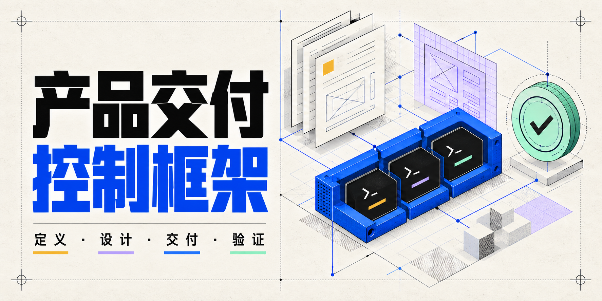
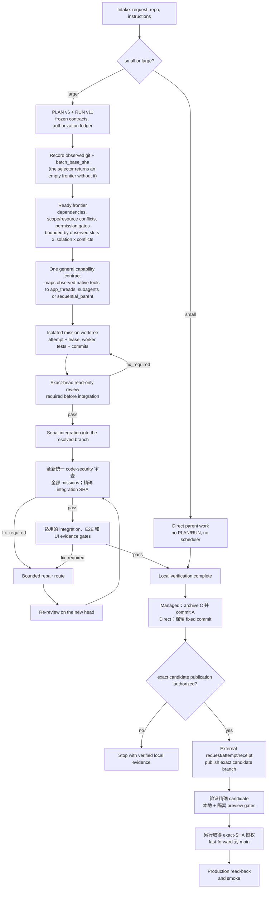

<p align="center">
  
</p>

<p align="center">
  <a href="README.md">English</a> | <a href="README.zh-TW.md">繁體中文</a> | <strong>简体中文</strong> | <a href="README.es.md">Español</a>
</p>

<p align="center">
  <a href="https://github.com/Phlegonlabs/product-delivery-harness/actions/workflows/harness-ci.yml"></a>
  
</p>

# Product Delivery Harness

验收按 atomic task 运行相关测试，按 mission 检查受影响的集成，再对固定候选完成必要的完整 matrix 与一次独立安全审查。只有已声明的依赖允许时，资源互不冲突的回归与审查才可同时进行；Managed selector 和必要检查的前置条件仍然有效。复用证据时保留原始精确 SHA；修复后重新审查，本地测试不能证明外部状态。

逐步流程的模板对照表列出每个现有模板的使用时点，包括可选视图与历史 Wireframe 模板；不为了用完模板而创建不适用的文档。

CI 回归会完整解析源 workflow 与 consumer CI 模板的 YAML，包括多行 candidate 与 diff-base 表达式。只有文本断言，不能证明 GitHub 能加载 workflow。

使用 skills 的项目保留各自批准的分支政策。这个 skills 源码仓库供我们自己使用：修改在临时工作分支完成，通过已审查的 PR 直接合并到 main，不需要 development 分支。历史 consumer RUN 保留原有契约。

[逐步流程](docs/WORKFLOW.zh-TW.md) 列出每个适用阶段的角色、现有模板及验证边界。同一 section 可在共享接口冻结后分给多位隔离的 frontend／backend writer；每个 executable task 保留自己的 atomic commit。按实际 host 容量派工，使用有界 packet、完成事件、streaming review 与串行集成。不把修改前／后验证当作重复工作删除，也不宣称已有尚未实现的 rolling writer scheduler。

Product Definition 撰写英文正式来源 `PRD.md`、`architecture.md` 时，同步产出完整繁体中文审阅版 `PRD.zh-TW.md`、`architecture.zh-TW.md`。Owner 通过中文审阅；实现与批准 digest 以英文为准，接受的修改同步到两份内容。[双语审阅契约](skills/product-definition-builder/references/bilingual-review.md) 要求在审阅及成对发布前核对来源哈希、ID 与完整语义。 任务检查发现已有 PRD 或 architecture 只有英文时，agent 会在同一目录补上完整中文审阅版，保留英文原稿与批准记录。只有 PRD 的项目可单独检查，不必创建 architecture。只读任务只报告缺漏，不自动翻译归档文件。

`AGENTS.md` 要求在任务开始、重要变更后及结束时检查本地 repository，即使不使用 Harness 或 PLAN/RUN。将有意义的已提交与未提交变更记录到对应 Epic，外部修改标为已观察但未验证，并更新 `docs/DOCUMENTS.md`。缺少基线就明确记录；没有新变化不重复写入。只读任务只提出记录内容，不建立后台监控，也不增加动作授权。

每次交接前都要重做 repository checkpoint，核对受影响的有效文档、对应 Epic 与索引，以及任务记录。Managed run 使用 renderer 的 `--check` 比对 PLAN/RUN 与生成的 `docs/tasks.md` 视图；RUN 才是权威来源，不能手动编辑生成区段。按语义将共用 `AGENTS.md` 规则与已观察到的安装版 project template 和版本比对；在现有文档写入授权内，只就地更新过期的共用规则并保留 repository 自定义规则。授权 bootstrap 会提出缺少的共用区段和同名规则差异；必须先用 reviewed merge plan 绑定观察哈希和标题选择才能追加。追加前须从已打开文件重验批准内容，结果必须精确等于原文加批准区块；并行差异须报错并保留全部内容。 Proposed additions 不代表已证明没有矛盾。按语义 reconciling 时不可覆盖刻意更严格的本地规则；后续 `--check --require-resolved` gate 检查 placeholder，不要求 template byte equality。如果 template 未观察到或语义合并不明，在交接时说明缺口。这是交接检查点，不是定时扫描，也不增加动作授权。

技能仓库，用于借助 Codex、Claude Code、Pi 或任何会发现用户 skills 目录的宿主，把产品想法或变更需求变成一条经过验证的交付流程。

它不是提示词集合。这套技能把产品定义、视觉设计、工程执行、代码安全审查、启用和 release 后自然流量 review 拆开，让每个阶段都有单一事实源、清晰的交接边界，以及自己的验证方式。

> 定义产品。编译设计。交付已验证的软件。

本轮审计修正统一已安装 skill 的命令路径、必要 CLI 参数、500 行职责检查点、schema-5 Wireframe Validation 与 reviewer shell v3。Activation 按发布目标选择正确 profile；security PASS 必须完整覆盖。Product Definition 审查确认 operations 的完整性；schema-5 UI approval gates 会验证已声明的 PRD operations 与 Wireframe／HiFi 的对应。现行 RUN 仅在本地完成，发布及 main promotion 各自保留授权。

## 统一设计审阅

HiFi 使用与产品 CSS 隔离的中性审阅器，按 App、Web 前台及管理后台分组，一次显示一个产品画布，保留平台尺寸、状态与取自实际样式的 Design Tokens 页。历史 Wireframe 保留原审阅器及检查。

审阅控件与面板使用 Shadow DOM，产品画布留在普通 DOM。实际状态控件会切换状态和尺寸内容；审阅选择按包件与平台保存，不跨包件混用。

`frontend-design` 直接读 PRD，默认提出三个可比较方向，owner 选定后才制作完整连通 HiFi。明确指定方向时可做一个；未改方向的 enhancement 沿用既有决策。编写前先验 PRD，Impeccable／H1–H9 前先跑便宜的 HiFi 完整性检查。一次 Visual Approval 涵盖文案、结构、可操作的菜单／Tab、交互、视觉及 tokens。Home、返回、取消、键盘、Escape 与焦点返回依 PRD operations 验证。

方向研究或 HiFi 编写前，检查 UI-stage bindings，并由实际作者完整读取已固定版本的 `frontend-design`。父级读取及 shell 组装不等于设计。受管设计派发仍需 `ui-design-builder` 与 `frontend-design`。

首次设计走完整流程；enhancement 只制作受影响页面及连接流程，并比较保留页面。日常修改直接验证当前产品及有效需求，不强制重建历史 HiFi。区分 source、已安装和 session 实际加载版本。新 `ui-output/3`／`ui-evidence/3` 保留真实观察、时间、工具、环境与候选哈希；机器结果不能伪造人工批准。旧格式保留历史语义。详见[审阅流程](skills/ui-design-builder/references/review-workflow.md)及[证据契约](skills/ui-design-builder/references/review-evidence.md)。

0.55.0 收紧 UI Design Builder 规则。Visual Approval 前必须完成 Impeccable critique 与 audit；其副作用仍需另行授权，owner 拒绝授权时 HiFi review 为 `blocked`。旧 Wireframe Approval 标题不会保留旧的 HiFi evidence 规则。2026-09-27 当天或之后决定的 legacy Visual Approval，或含有该日起运行的任何 HiFi Review 或动效 receipt 者，一律需要 `ui-evidence/3`、reviewer shell v3 与 direction/hifi 的 Frontend Design Usage 行；提交或回填较早日期都不会让它变成历史记录，其 Decided on 日期也不得早于这些 evidence。更早的批准只在 Approved target 与 HEAD 已提交的版本相同时，才保留其 `ui-evidence/2` HiFi receipt。Publication、design-system compiler preflight 与要求 Harness 0.55.1 或更新版本的 run 的 UI join 及 pair join 都会强制执行这条日期规则；只有 `check_ui_publication.py` 另外比对 target 与 HEAD。Schema-5 wireframe receipt 使用由 architecture Release Targets 推导的单一检查名称（`wireframe-browser`、`-extension`、`-desktop`、`-native`，hybrid 为 `-mixed`）与 wireframe 自身的案例顺序，因此同一组 receipt 可同时通过结构关卡与 Visual Approval。日期早于最新 HiFi、Impeccable、评分或动效 receipt 的 Visual Approval 会被拒绝。

现有设计 intake 会明确询问 owner 是否有参考图片、截图、网站、Figma 画面或产品，以及想学习和避开的部分。文字问题收集链接与偏好，图片通过对话附件提供。沿用已回答的内容；没有参考也可以，由 agent 研究合适方向并提出建议。在 `ui-design.md` 内以简短 Design Brief 将已批准 UI ID 对应到页面用途／profile，再关联字体／密度／标题约束、动效意图、已检查参考、具体视觉约束和避免规则，沿用 REF／RP、Style Integration 和动效记录。参考角色与避免例子是可选的；使用时必须有具体原因。已接受的 brief 决策会带入方向、HiFi、H1–H9，以及后续 compiler／实现权威。不另建文件或批准关卡，也不要求补填历史 brief。详见 [intake](skills/ui-design-builder/references/ui-design-intake.md)。

PRD 会在整个交付流程中持续补全。首次交付批准前，UI 与技术视角共同检查同一版草稿的完整使用流程、跨功能依赖、数据、权限、失败恢复与运营准备，区分必须补齐、已明确延后及待负责人决定的事项。后续设计、实现、测试与上线观察，通过现有产品流程回填证据及稳定 ID。维持一份当前 PRD 与中文审阅副本，不默默扩大范围、降低验收标准或改写已冻结的批准。沿用现有角色与检查点，不新增设计阶段或批准关卡。见 [PRD 补全规则](skills/product-definition-builder/references/prd-refinement.md)。

## 从这里开始

| 你目前有什么 | 从哪个技能开始 | 会得到什么 |
| --- | --- | --- |
| 一个产品想法 | `product-definition-builder` | 经 owner 批准的 Product Definition，包含完整 frontend/backend 架构、stack、UI 行为、release targets 和 tests |
| 已批准 Product Definition、需要 UI 设计 | `ui-design-builder` | PRD 预检、intake、方向选择、完整 HiFi、完整性检查、Impeccable／H1–H9、Visual Approval 与 design-system 决策 |
| 现有仓库中的明确变更 | `delivery-harness` | 小型工作直接实现；大型工作进入受管的 PLAN/RUN 流程 |
| 已固定并完成集成的代码候选 | `code-security-review` | 只读、绑定精确 SHA 的安全审查，包含经验证的 source-to-sink 发现与明确的覆盖缺口 |
| 已交付、需要外部设置的 release | `product-activation` | 精确授权的 console 动作、已验证的量测来源，以及逐 target 的 activation readiness |
| 需要 SEO 或自然流量分析的 production 公开网站 | `seo-growth-review` | 只读技术与量测 review、按证据排序的关键词／页面机会，以及已路由的后续动作 |

七个内置技能都可以单独调用；完整流程是可选的。但每种模式仍会校验明确声明的输入和依赖。

共享的 optional reference library 提供 19 个技术与设计领域的对比资料，不预设任何技术栈。[selection rule](skills/delivery-harness/references/reference-selection.md) 先从需求出发，只加载 [option-library](skills/delivery-harness/references/option-library/README.md) 中相关领域。它保留健康的既有技术；CSS/Tailwind、icon、Cloudflare、Expo/React Native、GSAP 或任何供应商都不是必选项。采纳结论写入既有 product、architecture、stack、UI 或任务记录，不新增 gate、register、runtime 或审批权限。

前端目录把 TanStack Start／Router 与周边生态分开比较；架构示例涵盖完整的托管 React、可迁移 React、内容、实时、Python 与业务应用技术栈，并补充 server-driven HTML、local-first 同步、durable workflow、租户数据隔离、headless 内容／条件式商务与独立 typed API，附失败检查及退出成本。成熟度观察附核查日期，各项目仍由既有 stack checkpoint 决定采纳。

设计参考涵盖组件基础、八种视觉方向，以及 Mobbin、Dribbble、Awwwards、Refero、MotionSites 的手动搜索。owner 分享选中的案例／原站链接或截图，不新增设计参考 MCP 连接。React Bits 提供动效组件，Anime.js 提供动画引擎；代码重用与依赖仍遵循既有 stack 和许可决策。

docs-weight 可见度报告会纳入嵌套的可选 reference Markdown，不新增 gate。

Cloudflare 目录分开 compute、data、agent／search、browser／sandbox、media／email 与分析职责。Basin、K2、Artifacts、框架 adapter、CLI 与技能候选保留当日成熟度或迁移检查；目录涵盖不代表已安装、账号可用或已可部署。

### 设计转译与可复用模板

App＋展示 Web 使用同一份 PRD，分别定义 iOS、Android 与公开展示网站；需要登录操作的 Web App 仅在指定范围内加入。React Native＋Expo 仅是参考方案，不是必选或默认技术；按产品需求选型并保留现有已批准决策。手机尺寸、Web 宽度、共用代码边界，以及各平台设计、验收与发布遵循[App 与展示 Web 规范](skills/product-definition-builder/references/mobile-stack-selection.md#app-and-companion-web-contract)。选用 Expo 不代表已决定网站技术或批准付费 EAS 服务。

内部 HiFi 规则要求实测控件挤压、对齐、内容裁切与展开图层，并按产品任务审查 AI slop。检查长文案、文字放大及 Web 目标之间的宽度，保留元素级证据并修正共用原因；隐藏溢出或提高分数不能清除布局缺陷。沿用现有审查关卡，不要求 Hallmark。

[现代设计来源指南](skills/ui-design-builder/references/modern-design-sources.md)把 Web 无障碍、Apple／Android 平台规范及近期 Anthropic／Google Labs AI 设计方法对应到现有 handoff 与审查；区分标准与风格建议，保留平台选型、审阅宽度与修复次数限制。 [页面设计设置](skills/ui-design-builder/references/page-design-profiles.md)按用途采纳 Taste：landing／portfolio 可选有辨识度的字体、桌面一至两行主标题与必须呈现的表现型动画；后台总览、数据页与表单优先可读密度及功能反馈。沿用现有 brief，记录选择与手机、翻译、减少动态效果的例外，保留已批准决策。

[动效与媒体路由](skills/ui-design-builder/references/motion-and-media-routing.md)现在有明确的升级顺序：CSS／WAAPI，接着是 Motion、GSAP、Three.js，每一层都要已批准的技术栈包含它才使用。Higgsfield 提供生成媒体，包括给已批准 Three.js 区块用的 GLB 模型。owner 没表态动效等级时，依页面实际要展示的内容提出建议，并在方向比较中实际播放。是否使用生成服务、用在哪些区块、费用上限，都在设计 intake 一次问完。HiFi 的媒体以 `data:` 内嵌；无法在 HiFi 运行的库改用确定性的近似效果，并标记到第一个实现切片验证。H6 另外评动效工艺；检视过的参考要留截图或录屏，采用 template 代码时记录授权。

方向研究与 HiFi 使用 PRD 批准的确切 responsive targets。保留的旧 Wireframe 模板有 390、768、1024、1440 px 示例；它们是审阅宽度，不是强制断点或新版编写阶段。

设计 Prompt 直接读 PRD UI Surface Contract。在既有 Design Brief 的 Page-purpose mapping 记录必守限制与设计自由，不复制每页需求。先比较主要／压力案例，再将选定方向展开成完整 HiFi。PRD 决定必要行为与内容，设计者决定构图和视觉表达。

局部更新保留未指定范围。明确要求“保留 PRD、整套重做”时，按实际加载规范重新构图与选择方向，保留产品、技术、文案约束及已知使用问题；旧设计与批准仅作历史，替换、归档、安装仍依各自授权。新 iOS 范围默认 iPhone，以较小／较大手机和 Dynamic Type 检查；iPad 按需加入，现有 PRD 要求不能直接删除。HTML 不证明原生行为。

七个 [composition recipes](skills/ui-design-builder/assets/templates/composition-patterns.json) 保留为方向／HiFi 的选用参考：四类 Web、三类 iPhone。按产品选择、调整或舍弃，保留双语文案、语言／方向标记、长文案及 PRD 语言矩阵；不强制套用 hero／features／CTA。

Skills 更新后及实现前，执行[设计有效性检查](skills/ui-design-builder/references/design-freshness.md)，比对产物与上游哈希、skill 来源及下游依赖。未知身份保持未知；skill 变更需要语义判断，不等于全部重画。`check_design_freshness.py` 仅只读检查，不给设计批准；清单包含所有 HiFi 子页，完整验证器仍必须执行。确认尚未实现时，先补齐受影响设计再写代码。


## 核心保证

- **恢复保留身份与证据。** Launch recording 分开父代理的 `--session-id` 锁与 `--worker-session-id`。新增的历史 review admission 匹配保留的 attempt；旧 PASS 不覆盖新 head。没有中断 reconciliation receipt 的 blocked sibling review 会阻止 candidate 移动。当前 role-bound 中断 mission 必须先有确认停止的 failure receipt，才可 reconciliation 和重派。Dual-branch archive 验证冻结 base 的 ancestry，保留 main 观察；旧 pins 保留原规则。Review packet 可保留带 SHA-256 与 name-status 清单的完整外部 diff；截断预览必须补完整检查，security integration review 一律检查完整 scope。新 UI 入口用 `/3`，保留 `/2` 维持原批准语义。

- **实现前主动提供建议.** 用户没有技术偏好时，提出符合产品的默认建议及替代方案，涵盖前端、部署、后端/runtime 和 agent 编排，说明兼容性、成本假设与重新评估条件。Enhancement 先检查现有 UI，展示受影响范围的前后比较。研究 template 与 CSS 参考时检查授权和 stack，手机界面保留原生惯例。明确要求的 hero 和动效持续跟踪至交付。Visual Approval 要求每个动效具备绑定哈希的正常及 reduced-motion 观察记录；HTML 证据只证明审阅投影。
- **小型工作保持精简。** 一个有界变更只走检查、实现、验证和审查。
- **大型工作明确记录。** PLAN v6 定义 typed graph；RUN v11 记录授权、尝试和证据。
- **先批准 Product Definition，再进入 UI 设计。** research-first evidence、适用 baseline、完整 candidate、明确 recommendation choices，以及 accepted delta 都在最终 approvals 之前。每种 release surface 都由同一份封闭 applicability matrix 决定必填架构与 stack：hosted UI 需要 frontend，native UI 需要 mobile/desktop，service 与 agent 需要 backend/data/interface，CLI 需要明确 toolchain。Product 与 Stack 批准绑定 canonical content digest、结构化 revision、非未来时间，以及每个保留 open item 的精确接受引用。每个人工 review gate 都会主动提供完整待审版本的已验证 Markdown 绝对路径链接，并在明确批准前停止。UI 产品仍只在 owner 明确要求后进入 `ui-design-builder`。 CLI 与 `other_nonpublic` 共用标准 `Toolchain` 批准 area（`CLI/toolchain` 为别名），分别记录 language、toolchain、distribution mechanism 与 testing layers。
- **安全从 Product Definition 开始。** 所有可执行软件——包括 static site、client、CLI 和 agent——都记录由人工负责的 Security Requirements Gate。每条 required row 追踪既有 PRD 需求与安全 TEST；Harness task gate 会在 commit 前实现防护措施，并用 negative tests 证明拒绝访问和没有未授权副作用；最后仍须执行全新的 exact-SHA code-security review。

安全豁免还须有 documentation-only 产品描述与 Product Archetype，并明确记录不存在的可执行架构接口。Required security TEST 信号与 Harness criterion 使用 `denial: rejected (<signal>); no unauthorized side effects: unchanged (<state evidence>)`，两项断言均须有具体观测。
- **建议不等于实现权威。** 每个适用领域先给出两到三组 coherent stack。新选择获批后标记 `Approved`，现有选择是 `Selected`，硬限制是 `Required`；`Recommended` 和 `Provisional` 会阻止 delivery。Checkpoint 的封闭 area set 必须等于适用且已解决的 areas，获批 option 的 layer map 必须等于可执行 stack rows。`render_stack_option_map.py` 会从既有 rows 生成供 owner review 的候选 map；它不能批准或改写包件。明确 option map 以 `||...||` 包裹；只用逗号的 legacy map 仍可读取，但 layer 名称或 selection 含逗号时必须使用明确形式。Frontend 的 component foundation 可以是一个 headless React primitive 层（Base UI 或 Radix Primitives）加上自定义组件；每个产品只选一个。Radix Themes 属于 packaged suite。HiFi 依该层的状态与焦点行为绘制，不改变 stack。
- **完整 UI 包一定附完整 Design System。** 新的初次与完整重设计使用 `UI contract: ui-design/3`：在 `docs/design/directions/<round>/` 默认做三个可渲染方向，每个由同一作者自查；owner 选择、混合或修改；完整 HiFi 检查全部批准尺寸及网页中间宽度；并必须产出 `design-system/4` 的 Markdown／JSON／HTML（`Package action: compile|update|reuse`）。HTML specimen book 以沙盒 plate 展示批准 HiFi 的全部 token、区间、已登记组件 variants、状态、响应式尺寸与动效，可重播、停止及 reduced motion。每个必要状态都须有明确分类行，包含 default。动画证据须绑定 specimen 胜出的 CSS 声明与具名 keyframes，包含重要性、选择器优先顺序及已解析的自定义属性。不支持的动画 CSS、转义字符声明及无效简写列为 finding。保留的 `ui-design/2` 只在 required 时编译 `design-system/3`；其 `not_required` 批准保留原义。 单方向只在 owner 明示选择、记录人类 Decision owner 与 Decided on 时成立；研究数量必须符合该选择。 经验证的 `none`／`style` maintenance 保留历史设计，不代表重新批准 pair 或 preview。 没有相邻批准网页宽度时，记录完整的 `Intermediate width check: not_applicable — no adjacent approved web viewport widths`；原生 size classes 与其他 HiFi 证据仍须完成。
- **保留的设计包直接由 PRD 进入 HiFi。** `UI contract: ui-design/2` 明确选择保留流程；新的初次与完整重设计使用 `ui-design/3`。PRD 预检验证 operations、states、responsive 与 copy status；HiFi 在 Impeccable 前验证实际文案来源及产品操作覆盖。默认三方向，选定后一次审阅完整 HiFi。原生 HTML 仍只是设计证据。旧 schema 与固定版本 RUN 保留原义；缺少 Wireframe 不会自动放宽检查。
- **HiFi 页面必须由产品控件连通。** 新增或修订的 `ui-hifi/2` 以 `index.html` 清单绑定同目录 HTML 页面的哈希与控件目的地。现行 `ui-output/3` 观察逐 responsive target 验证点击及键盘操作；缺页、过期哈希、无效控件、错误目的地或未声明跳转均阻止批准。每页只能呈现分配给该页的 surface。发布与保留须包含完整包；schema-1 仅供读取检查，正式 Visual Approval 一律要求 HiFi schema 2。历史 output/2 与 evidence/2 保留原意。指定 Git revision 冻结时，该 revision 必须包含所有子页面且内容一致。
- **视觉质量有独立门槛。** HiFi 的 H5（避免模板感）、H7（创意辨识度）与 H9（设计一致性）各须达到 80；总分 90 不能抵消视觉分项不足。审查须引用已检查的截图与已确认的方向原则；数字验证不代表美感或人工检查已获证明。
- **以实际代表画面选方向。** 各方向使用相同主要／压力案例与内容，涵盖适用平台并保存截图及 hash。小型可播放动态展示 normal／reduced motion，只供选择，不等于最终证据或 provider 授权。选定后才展开完整连通 HiFi。
- **平台共享品牌，分别定义控件。** Platform rules 逐批准平台记录规则。iOS 明确评估 system text styles、Dynamic Type、SF Symbols 与原生操作／版面，不强制套用 Web 组件库。HTML 仅供审稿；原生实作先以平台工具验证代表案例，再扩展其他画面，最后仍须完成全矩阵验证。
- **工作节点彼此隔离。** 写入任务使用独立工作树和有界范围；父级会验证每个返回的提交和差异。
- **每次执行都有记录，本地验证为默认。** 新 PLAN 明确使用 `execution.isolation: "host"`，以项目工具链执行 build、lint、test。结果保留 exact SHA、命令身份、工作目录、退出码、log 与源码／Git 检查。本地验证会在最终源码／Git 检查前结束其所属子进程，超时也会清理。本地命令顺序执行且每次重跑，具有当前用户的权限；worktree 不是操作系统沙箱。选用 `container` 时仍须通过 Docker/Podman 信任、固定镜像与隔离检查，失败不会自动改用本地。执行前仍须 reserve，inspector 不会从 phase 推断进程是否存活。 独立 worker 在各自 worktree 启动后才等待结果；本地验证不会限制 mission 并行数。容量必须按现场观察更新，不能沿用默认的单个 slot。
- **Runtime binding 明确可验证。** `lease-worker` 从选择器 directive 派生 provider、driver、model、effort 和 portable runtime axes；只有 app task 接受 `--task-thread-id`，既有精确目标可直接沿用，新精确目标只能从已启用的 wildcard 授权 materialize，不会扩大权限。
- **有能力不等于有权限。** 即使运行时能够推送或清理，每个动作仍需要精确授权。
- **Activation 必须读回验证。** Activation、Outcome、SEO 会先重验已批准的 Product/Stack bytes 与完整 Deployment contract。Outcome coverage 保留 PRD method、owner 与逐 target 精确 source map；measurement window 必须在各 target 可用之后开始。Multi-target review 只允许一种 mode，primary fields 绑定第一个有序 target，现有 rows 只能 append，aggregate verdict 与 follow-up 由规则决定。
- **SEO growth 必须以证据为准。** Lifecycle SEO review 只接受精确、公开、可索引的 hosted-web production target；不同 mode 必须记录 market、language、outcome、timezone、comparison windows 与 segmentation。逐 source 的 verified time 与共同 data-coverage boundary 分开，Search Console 与 GA4 仍分开解读。
- **证据跟随 SHA。** 新的提交会让旧 head 的门禁和 UI 证据失效。
- **UI 证据证明版面，而不只是像素。** 固定到 harness 0.34.0 及之后的 RUN 会在每条 route-breakpoint-state 证据行记录真实浏览器几何扫描的 `layout_check`；每个 UI 任务在验收前分类影响（`none`/`style`/`structure`/`both`），被接受的 parity 偏差连同引用记入 deviation ledger，上线 motion 必须追溯 `ui-design.md` 的 Motion and Media Intent。固定到 0.35.0 及之后的 RUN 还会机器校验 `deviation_ledger` 与逐 mission 的 `ui_impact_summary`。
- **完成的 managed run 会在晋升前收档。** `archive_run.py` 在 no-follow handle 下重验 C、当前 `main`、完整 coordination inventory、evidence 与 move list，以 durable journal 执行 C→A，并在 recovery 时保留并行用户数据。Archive-only A 先针对 checkout 外部 immutable anchor 重验；本地 agent 只准备绑定 machine policy、verifier 与 detached trusted-host evidence 的 handoff，永远不执行 publication argv。Direct 工作保留固定 verified candidate，不虚构 PLAN/RUN archive。
- **Parity 靠实拍，不靠记忆。** hosted-browser surface 逐 route×viewport×state capture；extension、native 与 desktop app 使用平台工具或明确的人工 capture，不能用 hosted URL 替代。任何不支持的 required group 都让结果成为 partial、不可作为 gate。每行绑定 Git blob、authority hash、baseline、capture method、trusted launcher identity 与 layout result。 截图文件名包含完整 surface/route/breakpoint/state tuple 的 SHA-256，避免名称规范化或大小写不敏感的路径合并不同证据。
- **读规则是强制的。** 种子化的项目 `AGENTS.md` 要求：受管工作前必读已安装的 `delivery-harness` SKILL.md，影响产品的直接工作前必读受影响的 PRD 段落；跳过即 blocking review finding。
- **代码安全是全新的最终审查。** 所有 code PLAN 都必须执行 `code-security-review`；`not_applicable` 只允许窄范围纯文档工作。实际 candidate path 必须落在 mission/security scope，并且永远不能带入 parent coordination files。项目要求的 security commands 是 graph 排序的 host 或 container verifiers；review 前会核对 exact current-head execution key。PASS 必须绑定 exact SHA、完整 coverage、零 exclusion，且不可复用旧结果。
- **Release source 使用 dual-branch policy。** 0.59+ managed PLAN 会在 ordinary work 冻结 remote `development`、在 hotfix 冻结 remote `main`，再使用 non-protected run branch。Harness 0.38+ RUN 在 C 以 local-only 关闭，不能由 RUN push。A 的授权 publication 必须同时携带 pre-archive external anchor、immutable request/attempt/receipt 与 trusted-host/human boundary；candidate gates 通过后，ordinary flow 先把精确 A 落到受保护的 `development`，再把完整验证的 SHA 升级到受保护的 `main`；hotfix 则先升级 A 到 `main`，再 no-force forward-integrate 到现有 `development`，并验证保留 development work 的 SHA T。两个 protected branch 都永不删除。如果 A 之后的 candidate/preview evidence 失败，就在同一 non-default branch 以精确 A 创建新的 PLAN/RUN continuation，保留 branch policy，导入原 verified scope 与 repair、把 A records 绑定为历史输入，关闭 C2、用新 anchor 收档 A2；不能改写 A history 或复用旧 records。已 publication 的 A 要求 A2 remote pre-state 精确等于 A；未 publication 的 A 则必须保持 absent。

前端选型指南按明确的 release-source 协议记录来源：`dual-branch/1` 使用已验证的受保护 development SHA，旧协议使用 candidate branch/SHA。两者的 production 都需要另行授权并验证 main promotion。

创建 RUN 前，只有 PLAN 的验证会一起检查明示的分支政策及 architecture 标记。缺少 RUN 不代表旧版本固定，也不授予执行权限。

## 包含哪些内容

| 技能 | 适用场景 | 主要产出 |
| --- | --- | --- |
| `product-definition-builder` | Discovery、research、security requirements、可量测产品/UI 行为、完整 frontend/backend 架构、coherent stack、release targets、tests 与 Product Definition Approval | 已批准的 `PRD.md`、`architecture.md`、`stack-decisions.md` 和研究产物 |
| `ui-design-builder` | PRD 预检、intake、默认三方向、完整 HiFi、完整性检查、Impeccable／H1–H9、Visual Approval 与 Design System Need Gate | `docs/design/ui-design.md`、方向研究及已批准完整 HiFi 包 |
| `design-system-compiler` | Visual Approval 后按需把已批准 `ui-design.md` target 编译成冻结 design-system pair，并生成来源绑定的 HTML specimen book | `docs/design/design-system.md`、`docs/design/design-system.json`、`docs/design/design-system-preview.html` |
| `delivery-harness` | 共享的规模判定与 security task gate、PLAN/RUN、授权、本地验证和集成，外加 runtime adapter 参考文档（`references/runtime-adapters.md`）：所有宿主共用的能力契约，agent 按观察到的原生工具自动对应 | 直接完成的工作，或 `PLAN.md` + `RUN.md` |
| `code-security-review` | 实现与统一集成后的只读安全审查，优先由 fresh sibling agent 执行；主动渗透测试与修复不属于本技能 | 精确 SHA 决策、trust-boundary 覆盖、验证后的发现与修复测试 |
| `product-activation` | 所有支持的 Web、API/backend、iOS、Android、macOS、Windows、browser-extension 与 hybrid release target 的交付后设置，包括 capability routing、精确外部动作授权、read-back、量测来源与 outcome-review 交接 | `docs/ACTIVATION.md` |
| `seo-growth-review` | 只读的 release 后技术 SEO、量测完整性、关键词研究、自然流量诊断与 query-to-page 机会排序 | 默认 inline review；明确要求时才保存日期化报告 |

交付核心在调用托管编排之前，会先做一个规模判定：

- 小型工作保持直接执行，不建立 PLAN/RUN，但先解析必要角色。UI 作者使用 host 绑定的 frontend worker，不由 parent 代写；只读委派本身不要求托管 RUN。
- [Parent 派工契约](skills/delivery-harness/references/delegation-contract.md) 适用于 Product Definition、UI Design 和交付。有两个独立实质研究／探索问题且具备授权与能力时，必须派出不同的 researcher／explorer 实例；容量不足就分批。纯数据 API `readonly-assignments/1` 按 assignment、attempt 和冻结输入身份汇合，允许结果重排，拒绝缺漏、重复、过期或重用 worker 的结果。Parent 的启动观察与子代理声明分开验证。启动前检查必要角色及外部执行授权，缺少必要 delegate 不得默默交回 parent。Fallback 仅按 host 的可用性错误规则，确认终止并保留部分成果。每个 checkout 同时只有一个 writer，包括 parent；独立审查仍须具备实际所需工具。
- 架构任务先展示调用示例，再定义状态 ownership 与失败恢复。代码审查将这个方法用于受影响边界；局部修正沿用已接受的决策。
- 大型工作进入托管规划。它可以用 `PLAN.md` 和 `RUN.md` 完成一次受管顺序交付，或者处理多个任务并实现可持久的移交；`new_run.py` 在带 `--out` 和 `--repo-root` 时写出初始 `docs/tasks.md`，带 `--repo-root` 的受管 `accept-wave`、`record-worker-result`、`reject-worker-result`、`record-integration`、`reconcile-candidate-head`、`reconcile-coordination-head`、`reconcile-interrupted`、`reconcile-interrupted-reviews`、`close-wave` 转换会刷新它并保留 Update Log。Projection 失败不会回滚 RUN；独立的 `render_tasks_view.py` 负责修复或检查这份非权威视图。本源码仓库不再另外维护根目录 `Tasks.md` 流程记录。

每个必要的集成或 wave 收尾 checkpoint，可先以一个普通直接子提交提交精确 coordination 文件，再新观察并用 `reconcile-coordination-head` 绑定该 head。守卫只接受支持的精确 coordination/generated-view 路径，排除产品与冻结设计来源，检查 live/observed 身份与干净产品字节，保留旧证据并重开当前精确 head 的 review/gate；隔离 mission worker 可继续，但 parent 端 reviewer 与检查必须静止。

- 选择器会在实际选中的安全写入 mission 少于两个时派生 `managed_sequential`，达到两个或更多时派生 `parallel_graph`。只有后者才启用调度器扇出；runtime driver 仍是独立的传输事实。核心共用一份能力契约，由 agent 对应当前原生工具，不按 provider 分流。
- RUN 执行不等待远程 CI；branch promotion 是独立 closeout。精确 candidate 与适用的隔离 preview environment 验证完成前，`main` 不得移动。

只有 RUN 与它已声明的生成 tasks view 例外于干净目录检查；verifier 仍用哈希保护两者。产品修改和手写 view 仍会阻止执行。日常 RUN 操作使用 guarded transitions；正式 revision 保留历史并取得精确的新授权。若包件只有 `Selected`／`Required` layers，没有新批准 option，保持 `Approved option map: None`，跳过可选的生成器。 检查器接受不分大小写的 `None`；只有没有新增批准 layer 或 option 时，才可省略选项表。

规模指的是协调范围和影响面，而不是原始的文件数或行数。如果小型工作变大，Harness 会保留已完成的工作，只对剩余部分做规划。

## 系统如何协同

保留的 `ui-design/2` 包不再制作灰阶 Wireframe 或执行 W1–W5 阶段。直接用代表视觉研究探索布局、字体、层级与 responsive，再于 HiFi 验证。旧 Wireframe 工具只供历史产物只读查看与验证。

HiFi 提供完整、取自实际样式的 Design Tokens 页。`ui-design/3` 包一定编译 `design-system/4`：`showcase` 把每个 primitive variant、组件状态与动效绑定到批准的 HiFi 元素，`design-system-preview.html` 以 specimen book 呈现，不自行发明样式。`ui-design/2` 在 Need Gate 要求正式 pair 时才生成 `design-system/3`。两者都绑定已批准 PRD、architecture、stack、UI contract 与 HiFi 包，不再绑定 Wireframe。

HiFi 以内嵌 `ui-hifi-copy/1` 及产品 DOM 绑定保留文案来源。静态文案、动态显示契约及成对语言仍可检查。Tokens 展示实际数值、用途及控件变体；审阅器文字不能代替产品覆盖。

Token 观察分别保留来源／显示原值及浏览器规范化后的来源／应用值，让十六进制色码、rem 尺寸及关键字字重能正确比较。

```mermaid
flowchart LR
  Idea["产品想法或变更请求"] --> PRD["Product Definition candidate\nPRD + architecture + stack"]
  PRD --> Market["草稿后市场研究与回填"] --> ProductGate{"Stack Decision + PRD 自查 +\nProduct Definition Approval"}
  ProductGate -->|"UI 产品批准且明确要求"| UIDesign["ui-design-builder\nintake + 方向研究 + UI 自查"]
  UIDesign --> UIReview["选定方向 + 完整 HiFi\n完整性 + 自查 + Impeccable + H1–H9"]
  UIReview --> Design["已批准 HiFi target\n需要时进入 design-system-compiler"]
  ProductGate -->|"已批准的 headless 产品"| Harness["delivery-harness\n共享交付核心"]
  ProductGate -->|"已批准的限域增强或维护；无受影响设计 gate"| Harness
  Design -->|"批准的全页面 HTML reference 或设计系统契约"| Harness
  Harness --> Runtime["观察原生能力\n共用通用契约"]
  Runtime --> Security["code-security-review\n全新统一 exact-SHA 审查"]
  Security --> Evidence["完整最终测试与 UI 证据"]
  Evidence --> Close["RUN 在精确 integration head 关闭"]
  Close --> Archive["在 run branch 归档协作状态\ncommit + 重验 archive-only candidate"]
  Archive --> Push["checkout 外部 request/attempt/receipt\n精确 candidate publication"]
  Push --> Candidate["验证精确 candidate SHA\n本地 + 隔离 preview gates"]
  Candidate --> Main["另行授权 fast-forward\n精确 SHA 到 main"]
  Main --> Activate["product-activation\n外部设置 + read-back"]
  Activate --> Outcome["已验证量测来源\n后续 outcome review"]
  Activate -.-> SEO["seo-growth-review\n可选自然流量 review"]
  SEO -.-> Outcome
```



从任何阶段继续前，先确认其前置条件仍有效。依[交付前自我 review 契约](skills/delivery-harness/references/pre-delivery-self-review.md)，PRD 草稿完成市场研究与已接受建议的回填后，由作者自查整套产品文件；选择方向前自查 UI 结构与方向；HiFi 完成后先自查，再进独立审查与 Visual Approval。版本、问题、修正及未解阻挡项记在既有任务记录。自查不代替必要的独立审查或人工批准。UI 产品的初次交付必须完成适用检查后才进 Harness 执行，不能用“延后 UI”绕过；headless 产品注明 UI 检查不适用，增强与维护则检查其已接受范围。这是 parent 的语义检查，验证器成功本身不证明已自查。

Harness 0.57.0 移除 UI 产品初次交付的“延后 UI”捷径，包括先做 backend 的切片；backend binding 检查不豁免交接要求。新任务沿用旧批准时，在当前交接点补做适用范围的自查，记录批准与 candidate 身份，不回填假日期，也不重开未变动的 owner 决策。较旧 pinned RUN 保留原契约。

### 完整技能生命周期

七个 skill 的完整生命周期，包含每个闸门与横切机制：

```mermaid
flowchart TB
    user([用户想法或变更请求])

    subgraph PRD["product-definition-builder — 产品定义"]
        direction TB
        interview[结构化访谈<br/>3 段 free-text + AskUserQuestion]
        pkg["核心套件 candidate<br/>PRD.md + architecture.md<br/>+ stack-decisions.md"]
        mr["market-research.md<br/>（对账 candidate，可跳过）"]
        rchoice{{"平台优化建议<br/>owner accepts / revise / defer / reject"}}
        revision["只应用 accepted 变更"]
        sgate{{"Stack Decision Checkpoint<br/>Required | Selected | Approved"}}
        pgate{{"Product Definition Approval<br/>所有产品"}}
        ra["research-first 评估<br/>research-assessment.md（可跳过）"]
        rgate{{"Research Gate<br/>go | clarify | stop"}}
        interview --> ra --> rgate --> pkg --> mr --> rchoice
        rchoice -->|accepted| revision --> sgate --> productself["PRD 作者自查"] --> pgate
        rchoice -->|revise proposal| mr
        rchoice -->|none, deferred, or rejected; no blockers| sgate
    end

    subgraph DESIGN["ui-design-builder — UI 设计（owner 明确要求）"]
        direction TB
        intake{{"UI Design Intake<br/>style + motion + media；等待 owner"}}
        preflight["PRD 预检<br/>operations + states + responsive + copy"]
        studies["frontend-design<br/>默认三个方向"]
        style["frontend-design<br/>Style Integration + HiFi target"]
        hifi_review["Impeccable critique + audit<br/>H1–H9 评分"]
        vgate{{"Human Visual Approval"}}
        dgate{{"Design System Need Gate"}}
        pending["已批准 required/pending marker<br/>绑定 Visual Approval digest"]
        pair["design-system-compiler preflight + compile<br/>design-system.md + design-system.json"]
        linked["Owner 链接 pair hashes<br/>final UI validation"]
        intake --> preflight --> studies --> directionself["UI 结构与方向自查"] --> directionChoice{{"方向选择"}} --> style --> completeness["HiFi 完整性预检"] --> hifiself["HiFi 作者自查"] --> hifi_review --> vgate --> dgate
        dgate -->|required| pending --> pair --> linked
        dgate -->|not_required| target[核准的 page-faithful target]
    end

    subgraph HARNESS["delivery-harness — 交付核心"]
        direction TB
        route["System Review And Route<br/>（parent-only、read-only）"]
        size{{"Project Size Gate"}}

        subgraph DIRECT["Direct 路线（small）"]
            direct_impl["直接实现 -> 本地验证<br/>-> code-security 审查 -> 授权 Git 动作"]
        end

        subgraph MANAGED["Managed 路线（large）"]
            direction TB
            plan["PLAN v6<br/>typed graph：missions / reviews / gates<br/>allowed_providers + 原子 task commit"]
            newrun["new_run.py 产生<br/>RUN v11 + 12 键授权 ledger"]

            subgraph LOOP["执行循环（每个 wave）"]
                direction TB
                lock["--session-id acquire-run-lock<br/>（run lock + heartbeat）"]
                obs["record-observation<br/>live-Git 快照"]
                sel["select_ready_nodes.py<br/>确定性 frontier 选择"]
                accept["accept-wave<br/>（batch base 绑定）"]
                adapters["按共用契约解析<br/>可用的 agent driver"]
                lease["lease-worker<br/>（worktree + lease + graph 绑定）"]
                workers["fresh bounded agent workers"]
                record["record-worker-result<br/>重校验证据 + 原子 RUN 更新"]
                review["exact-head review<br/>（reserve -> reviewer -> record）"]
                integ["record-integration<br/>（序列集成；统一候选 SHA）"]
                lock --> obs --> sel --> accept --> adapters --> lease --> workers --> record --> review --> integ
            end

            plan --> newrun --> LOOP
            security["code-security-review<br/>fresh sibling；全部 missions；精确 SHA"]
            gates2["广域 final validation<br/>（E2E / 回归 / UI 证据矩阵）"]
            LOOP --> security --> gates2
        end

        route --> size
        size -->|small| DIRECT
        size -->|large| MANAGED
    end

    subgraph DEPLOY["部署（git-connected 平台）"]
        direction TB
        handoff["Managed：更新 docs/DEPLOYMENT.md<br/>（typed targets + secret 名称 + console 任务）"]
        archive["关闭 RUN、归档协作状态<br/>commit + 重验 candidate"]
        push["checkout 外部 request/attempt/receipt<br/>精确 run-branch candidate publication"]
        directhandoff["Direct：更新 deployment record<br/>保留单一 fixed verified candidate"]
        directpush["另行授权 direct<br/>candidate publication"]
        preview["Preview 自动部署<br/>（平台按 push 构建）"]
        merge([另行授权 exact-SHA<br/>fast-forward 到 main])
        prod["Production 部署<br/>（平台从 main 构建）"]
        check["部署后验证（只读）<br/>check_deployment.py"]
        status["核对 deployment 记录<br/>（状态 + 待人工处理事项）"]
        handoff --> archive --> push --> preview --> merge --> prod --> check --> status
        directhandoff --> directpush --> preview
    end

    subgraph ACTIVATE["product-activation — 交付后启用"]
        direction TB
        profiles["选择 core + surface profiles<br/>docs/ACTIVATION.md"]
        capability["探测 connector / API / CLI<br/>Browser / Computer Use / manual"]
        actions["精确 ACT-* 动作<br/>授权 + read-back"]
        ready["逐 target activation readiness<br/>已验证 MS-* 来源"]
        profiles --> capability --> actions --> ready
    end

    subgraph SEO["seo-growth-review — 可选 release 后 review"]
        direction TB
        seo_sources["Production 页面 + 已验证来源<br/>Search Console / GA4 / estimates"]
        seo_review["技术 SEO + 量测完整性<br/>query-to-page 机会"]
        seo_route["按优先级路由 follow-up<br/>不直接修改"]
        seo_sources --> seo_review --> seo_route
    end

    subgraph OUTCOME["Release 后 outcome review"]
        outcome["docs/product/outcomes/YYYY-MM-DD-release-set.md<br/>（owner 主动要求，量测窗口后）"]
        verdict{{"判定：no_change | enhancement | incident"}}
        outcome --> verdict
    end

    subgraph CROSS["横切机制（贯穿各阶段）"]
        bindings["Skill Bindings<br/>（AGENTS.md 槽位表 + SHA-256 pin）"]
        ledger["授权 ledger<br/>12 个独立动作键"]
        ver["版本闸 + contract digest<br/>（compatible_old 波界）"]
        watch["watchdog + reconcile<br/>（中断恢复）"]
    end

    user --> interview
    pgate -->|UI 产品批准且明确要求 UI| intake
    pgate -->|已批准 headless 产品| HARNESS
    pgate -->|"已批准的限域增强或维护；无受影响设计 gate"| route
    linked --> route
    target --> route
    DIRECT --> directhandoff
    gates2 --> handoff
    status --> profiles
    ready --> outcome
    ready -.-> seo_sources
    seo_route -.-> outcome
    verdict -.->|下一次 enhancement 请求| interview
```

Product Definition Approval、UI Visual Approval 与合并到 `main` 是分开的人工闸门。Publication authorization 也独立存在；接受产品内容不代表授权覆盖或移动文件。

Product Definition 与 UI 的批准／交接回复，要在对话中逐份列出全部现行文档，附上已验证的绝对 Markdown 链接、用途与状态。包括中文审阅副本和英文来源、研究、方向稿、全部 HiFi 页面、审查证据、必要的 design-system Markdown／JSON／HTML，以及适用的项目／运营文档。两套完成后，合并成一份清单，在实现前进行整体 review。沿用既有批准，明确标示缺少或稍后阶段才产生的文档；预览面板或文档索引链接不能取代这份清单。

每个可部署版本都以 `docs/DEPLOYMENT.md` 作为操作交接文档。Product Definition 先定义 typed `Surface class` 与 `Public discoverability`；Delivery Harness 再把每个 development/production target 精确 join 到 provider/channel、endpoint 或 typed native disposition、Expected/Deployed SHA、artifact identity、availability evidence 与 checked time。Production 使用不带 `-prod` 的 `<product-slug>-<surface-suffix>`，development 加 `-dev`。文档只记录 secret/variable 名称与外部 console 任务，永远不保存 secret 值。

Production deployment 之后，`product-activation` 从 typed release targets 派生 profiles，只通过最安全可用路线执行精确授权的动作。Capability、read-back、behavior evidence、measurement sources 与 readiness 都绑定 target、environment、SHA、artifact、provider/channel 和 action digest。后续 strict Outcome Review 会逐字重复 PRD metric 或 TEST definition、baseline、target、window、production release 与相符 verified `MS-*` evidence。

Activation 默认进入执行：先盘点真实 delta，继续把 ready 且已授权的 action 做到 mutation/read-back/behavior，最后执行 closeout checker；只有 owner 明确要求时才是 documentation-only。`--require-closeout` 会拒绝停留在 ready、configured、pending、uncertain 或 stale 的 required action。只有 verified 工作或明确 concrete blocker 能关闭动作；blocked 状态让 record 保持 blocked。真正的 no-op 不需要合成 action，但每个 target 都必须有 concrete n/a disposition；verified handoff 仍要求 verified sources 与 target readiness。

Activation 之后，`seo-growth-review` 可对 typed public hosted-web production target 做独立只读 review。Dated report 必须对齐 Review date、deployment hostname、exact release、Activation hash、verified source roles、data cutoff 与 PASS integrity checks；它不修改网站或外部账户。

保存的 lifecycle SEO review 只要求所审查的 production target 在 Activation 中为 `ready`；其他 target（例如仍在商店审核的 app）可保持 pending。`check_seo_review.py` 只验证一次 Product Definition package 与 Deployment，把这些 findings 与其他 review findings 一起输出到 stdout；只有日期的 Data cutoff 会报告为 finding，不再崩溃。`code-security-review` 的 review packet 在 Contract JSON 中列出每个 PLAN `security_review.required_checks` ID，以及它在受审 head 上 PASS 执行的 execution key；结果会把这份清单复制到 `checks`。Reviewer 不返回 reason code：blocked 结果在 `coverage.gaps` 或 `evidence` 写明原因，派发阻挡由 parent 的 selector 记录。

循环在两端都闭合。Research-first evidence 先把关是否起草，并提供适用 baseline；完整 candidate 经过 post-draft reconciliation，owner 对 evidence-based recommendations 做明确决定后，才修订并进入 Stack Decision Checkpoint 与 Product Definition Approval。Metrics 现在包含 baseline、target/guardrail、measurement window、source/method 和 owner，让 outcome review 有可执行的量测契约。

Enhancement 会分类 product behavior、UI structure/style、data/integrations、architecture/stack、data trust/AI、commercial channels 与 release/operations。产品内容变化会重新打开 Product Definition Approval；UI 仍沿用 `none`/`structure`/`style`/`both` 并只更新受影响产物。

0.55.0 调整 Product Definition 检查。Package 与 Stack Checkpoint digest 现在覆盖原始文件文本，包括 fenced code、缩进行与 HTML 注释；只移除批准或 checkpoint 标记区块，CRLF 视为 LF。旧版记录的 digest 可能不再相符，因此要重跑 finalize，并重新记录 Product Definition Approval 与 Stack Decision Checkpoint。Mobile/Desktop stack 需要一行 `Styling approach` layer（例如 `platform theme`）。在 Enhancement Impact Record 中，UI `structure` 或 `both` 行要写明 Wireframe Validation 与 Visual Approval，`style` 行要写明 Visual Approval；Copy Freeze、Wireframe Approval 与 Impeccable/H1–H9 不再是必需名称。`check_product_package.py` 只有在 `--require-filled` 与 `--require-approved` 都执行时才输出 `complete and owner-approved`。Product Definition agent graph 只接受两个封闭的 release source policy：development 取自 run 的 integration head，production 取自已验证的 `main` SHA；tag 与其他 ref 会被拒绝。`--prior-outcome` digest 是前一份记录原始 bytes 的 SHA-256，与 `sha256sum` 或 `Get-FileHash` 的结果一致。

Gitignore 管理同时适用于 direct 与 managed 工作。scope scan 会记录任务是否改变 local-only artifact 类型，再按实际工具链生成最窄的规则。含值的环境与 credential 文件、可重建的 build output、dependency 目录、cache、log 和本地平台状态要忽略；source、tests、lockfiles、migrations、受跟踪的配置示例与 schema，以及权威产品或交付产物必须保持可见。程序新增环境变量读取时，同一个 task 要更新受跟踪的 example 与 ignore 规则。Harness 会用 `git check-ignore`、`git status --ignored` 和 `git ls-files` 验证代表路径；它不读取 secret 值、不用规则隐藏 dirty worktree，如果可能的 secret 已被 Git 跟踪，就停止并交给 owner 处理。

商业产品现在会经过两个分开的 Product Definition 决策。Monetization Infrastructure Gate 先解析商业模式、定价／offer 规则、购买 surface、entitlement source 与 merchant-of-record／税务责任，再比较 native store billing、RevenueCat、Qonversion、Adapty、Superwall、Stripe Billing、Paddle 或 Lemon Squeezy 等当前选项；有定价不代表默认 RevenueCat。Partner Channel Gate 则独立解析 `none`、affiliate、referral、reseller 或 hybrid，再比较 Rewardful、FirstPromoter 这类 link／commission 工具、PartnerStack 这类完整 partner platform、Lemon Squeezy 的集成 affiliate 路线，或自建 reseller service。Billing、entitlement、paywall、税务、attribution、commission／payout 与 reseller operations 会保持为分开的 PRD、architecture、stack、UI、mission 与 test 契约。

## 交付模型

验收会拒绝嵌入文本的身份占位符，并要求证据使用 checkout 相对路径，让保留的结果能跨 checkout 使用。

文档检查会列出变更来源、受影响成果与必须重验项目，由父代理审查语义差异；哈希与分流提示不代表批准。现有 `document-sync/1` snapshot 保持可读。

完整 enhancement 使用 `docs/epics/` 中有索引的 Epic，引用当前 PRD，不复制另一份。小修正追加到对应 Epic，必要时链接详细的直接任务记录。目标、写入范围、设计来源、依赖与验收方式整理到该记录或现有 PLAN/RUN，不增加中介规格。

实现前先选择记录方式：新的已接受目标建立 Epic；同一目标的小修追加到原 Epic 的 Change Log；独立小修建立精简 Epic 条目，可链接直接任务记录。记录原因、影响范围、commit、测试和未完成事项，不改写已结束的历史。UI enhancement 默认增量修改：只新增或修改指定的 HiFi 页面及必要入口／返回控件，保留其余布局、内容、样式与 ID，沿用已批准方向。修改共用组件前先列出受影响页面。完整画面覆盖和全套回归，不代表全部重新设计。

项目 AGENTS 保留入口、必读、文档分工、分流、同步、授权与完成条件。商业、启用与 managed RUN 细节移到按情境必读的参考文档。供使用项目套用的 AGENTS 模板要求 KISS、第一性原理、按职责拆分模块，以及不写推测性的兼容代码。使用项目的新代码／测试模块采用 500 物理行硬上限；此限制不适用于 Harness 源码，也不要求重构 Harness。

新写或修改的文档采用 [ASD-STE100 Issue 9](https://www.asd-ste100.org/about_STE.html) 的核心写作规则：主动语态、一句一个重点，以及一致的术语。程序每步写一个指令，必要条件放在指令前。英文程序句最多 20 词，说明句最多 25 词；代码与原样字符串不计入一般文本的词数。其他语言使用自然表达与一致术语，不套用英文词数限制。保留技术含义、需求强度、批准与历史。这是 STE-informed 项目准则，沿用现有文档审查，不新增交付 gate，也不宣称完整符合标准。

HiFi 审阅从主要产品页开始，侧栏可前往 Overview、各页与设计规格。产品交互、审阅导航及来源绑定 tokens 分别保留证据。历史包件保持可读。

HiFi 一次显示一个产品画布，设置实际审阅宽度并保留适用输入与状态。浏览器验证产品控件及状态变体，token specimens 绑定来源页。

HiFi validator 会检查侧栏中指向当前页面的链接是否带有 `aria-current="page"`，包括嵌套链接。父级或其他链接的标记不能代替它。

审阅证据也须涵盖未知链接、从各审阅面板按浏览器返回，以及在每个目标尺寸结束审阅后恢复主要产品页。

Full-stack 按完整流程实现页面、API、权限、数据保存与反馈。agent-browser 用于 Web 探索，重要流程另保留本机／CI 可重跑测试；登录、拒绝访问、重试与副作用都要有实际证据。发布涵盖 migration、健康检查、监控、成本告警与恢复，交付、发布、启用及产品效果分别报告。SEO 只应用于适用的公开页面。

升级至 0.50.0 时，先让使用 skills 的工作到达安全停止点，再执行 canonical installer，保留备份并开新 session；不可热更新已加载的 worker。按文档同步影响清单局部更新当前文档，保留自定义 AGENTS 规则与历史证据。现有 document-sync/1 与 ui-hifi/2 仍可检查；新的 HiFi 批准须补左侧审阅界面及绑定各页的 ui-output/2 reviewer 观察，只重做受影响证据，不改写旧批准。小修正沿用对应 Epic，不建立 PLAN／RUN；没有合适的 Epic 才建立精简记录。重跑受影响的 owner gates 与必需最终验证。 0.49.0 在实现前检查设计有效性，严格 schema-5 编制检查须提供绑定区域的 motionSpec；保留历史批准。 0.50.0 保留现有产品排版与已批准产物；新 Wireframe 默认显示注释。每个 HiFi token 须加上支持的 data-token-preview 属性及对应来源用法，再重建受影响的 reviewer 观察；保留历史批准。

每次调用 skill 都先应用共享的[文档同步契约](skills/delivery-harness/references/document-sync-contract.md)，检查当前指引、skill/runtime 身份与产品文档的变化，不改写历史批准或 RUN。当前 PRD 持续作为下一轮 enhancement 的基准，被替代的 PRD 保留链接供参考。[有界 enhancement](skills/delivery-harness/references/bounded-enhancement.md) 沿用一次确认的范围，执行修复、范围内 module 重写与重测，不反复要求批准。达到修复上限就把未解决需求移交下一轮；本轮结束不等于交付 PASS，也不授权发布。

[Generate、Verify、Correct 指引](skills/delivery-harness/references/gen-verify-correct.md) 把每个 stage 对应到 author、verifier 与 corrector。先用最短有效 focused check，到 mission、feature、platform 与 integration 才扩大，PASS 即停止。只读 finding 带着 expected／actual evidence 回到 owning flow；精确候选证据与既有 budget 继续有效。

[交付验收契约](skills/delivery-harness/references/delivery-acceptance-contract.md) 串联必要 PRD TEST ID、冻结的场景／平台矩阵与精确版本证据。只在已授权的隔离测试环境准备合成账户与本轮拥有的数据。Mock 登录不能证明真实认证通过；Web、原生 iOS 与 agent 工具结果各需自己的证据。Production 登录后门、含秘密的 fixture、跳过必要测试、过期 build 或延后处理的阻塞问题，都不能算 PASS。检查器验证覆盖与保留证据，不声称能证明人工声明或外部观察的真实性。

[Eval policy](skills/product-definition-builder/references/eval-policy-contract.md) 在已批准 PRD 冻结 rubric、样本分母、重复次数、pass rate、slice、critical 规则及 judge 输入。必须使用 `json` code fence，让 review 画面显示每个字段；前缀的换行及空白行须符合 Markdown 规则。已批准输入在 staging／发布时保持原路径，旧版本保留。新 package 的批准及发布检查使用 `--repo-root <root> --eval-policy eval-policy/1` 验证已批准输入的 bytes；普通产品填写有理由的豁免。必要功能 TEST 仍须全部通过。Legacy package 没有 marker 沿用原检查；已加入 marker 就会验证。

新授权 whole-platform 顺序的 authoring 会加入 `--platform-delivery platform-delivery/1`。Checker 读取 active architecture sequence、精确 release inventory、shared API/interface ARCH authority rows、human decision 及 Required-Yes PRD tests；只有 approved status 可以执行。Draft、duplicate、hidden、malformed、omitted 或 shared-label bypass 一律失败。没有 section 的 legacy package 保持原读法。

Harness 会把该契约接到 PLAN v6。Architecture order 决定 stage 顺序；surface mission 只映射一次，shared ARCH 先行，并用 pass-only dependency 到达 completion mission 和下一平台。Fresh completion integration 与 final gates 覆盖 platform TEST；retained integration PASS 只是历史 handoff。没有 marker 的 PLAN 保持 legacy。

另外，每个 planned `PRD-*` must trace 都要指定 fresh acceptance gates。其 TEST ID 来自 canonical Required-Yes PRD obligations，可加入其他必要 regression。

[Eval 验收契约](skills/delivery-harness/references/eval-acceptance-contract.md) 从 policy 推导执行契约，再重算每个已规划 trial。质量失败留在分母，prohibited 或 critical 失败直接阻挡验收。两份 full report 保留 output、judge／tool 观测、身份、时间和用量；handoff report 在干净 checkout 重跑。

`check_eval_acceptance.py` 在干净 H2 将两份 report 接上现有 delivery register，验证冻结 hash 及 H1 等价，再执行 delivery acceptance。冻结契约、已批准输入及交付文件必须已存在，内容、类型及 Git mode 符合 H1，即使同时登记为 evidence。交付的 [eval runbook](skills/delivery-harness/assets/templates/EVAL_RUNBOOK.template.md) 记录 setup、full／quick 指令、限额、失败案例重跑和自有 fixture 清理。Checker 不执行 runner 指令；review 仍核对证据来源。

RUN pin >=0.60.0 的 readiness 需要明确 eval applicability；required 时冻结 eval／delivery source，并强制 always-run gate：broad final checks → eval acceptance → delivery acceptance → closeout。错误 hash、替换 checker 或断开 gate 都失败。旧 pin 没有 marker 保留原契约；加入 marker即采用新检查。
两个 acceptance checker 使用安装目录及已观察 Python 的绝对路径，
明确在 host 执行，
避免 image 在同一路径放入替代 checker。
旧 pin 也必须安全读取 PRD authority；
无法读取是验证缺口，不能当作没有 policy。
解析 policy 有／无之前，读到的 bytes 都须符合
冻结 hash 及已声明的 Git revision。

Harness 是围绕明确的边界构建的：

1. 检查当前项目，识别需要完成的工作。
2. 冻结相关的契约、来源、范围和验证步骤。
3. 当任务大到需要时，在动手实现之前先规划依赖关系。
4. 只有当至少两个安全写入 mission 实际被选中、工作彼此独立且相互隔离，并且每个动作都获得明确授权时，才使用并行工作节点；受管顺序路线仍要证明隔离 writer、scope/head 和 review gates。
5. 验证任务结果与集成，执行全新的统一 code-security 审查，再验证相关 UI 流程与最终差异（diff）。单 mission 不会凭空增加跨 mission batch gate。
6. Harness 0.38+ RUN 在 C 以 local-only 结束，RUN 不会 push。完成 archive-only A 并重验后，任何 run-branch publication 都要使用新的 action-time instruction 与 checkout 外部 request/attempt/receipt；验证 A 后，才可另行授权把它 fast-forward 到 `main` 并 read-back、验证 production。

对于有计划支撑的工作，它会记录任务范围、依赖关系、工作节点归属、验证命令，以及针对具体动作的授权。一次测试通过并不等于授权推送、移除工作树或删除分支。Harness 0.38+ 会让 RUN push 保持 false；archive protocol 从 archive 推导 C 与 branch，验证精确 C→A relocation 以及 remote pre-state，绑定规范 URL 与已观察的 trust policy/verifier，只准备精确 URL-only no-force publication handoff 并交给 trusted host；recovery 先验证签名 evidence 再读回 A。Legacy pinned run 只保留旧流程供 recovery。

wave 接受前，Harness 会重新检查观测到的非默认集成分支及干净产品树，把 batch 绑定到该精确 head，重跑 selector，并且只接受完整的当前 frontier。clean-tree gate 只排除 transition 必然更新的那个精确 tracked RUN 文件；其他任何变化仍会阻断。集成分支位于 linked worktree 时，该 checkout 会正确记录为 parent，Git 的干净主 checkout 则保留为已识别的同级项。持久 run lock 负责 dispatch；短期操作系统锁串行化每一次 RUN 的读取、验证与写入事务。冻结的 PRD、完整已批准 HiFi 和 design-system source 会在独立校验与 transition 写入路径中按字节 hash 绑定；即使 PLAN 声称 UI surface 为空，冻结的 PRD 仍会被解析。每个结构化 PRD surface 只拥有一个 literal route；带 UI 的翻译 PRD 只能有一对语言无关的边界标记，并且每个条目各有一个 `route` 与 `states` 锚点；各产物的 ID、route 与 state 必须完全一致。design-system 的 Markdown 与 JSON 各有独立 source row，其 generated contract 与 compiler namespace 必须一致；每个 PLAN `DS-*` trace 也必须在同一个全局唯一的 JSON 注册表中解析。product-definition-builder 会按问题工具真实的每次容量分批询问所有适用的封闭决策；没有 Codex 专属的调用次数目标，也不会为了凑宿主次数而丢掉问题。

0.55.0 新增的规则只适用于要求 Harness 0.55.0 或更新版本的 run；较旧的 run 沿用记录时的规则。清理类 lifecycle 节点（`archive_worker_tasks`、`remove_worktrees`、`delete_branches`）即使有 run 范围的 `*` 授权，也必须有精确 PLAN target：PLAN 验证会拒绝缺少 target 的节点，selector 以 `action_not_authorized` 推迟它，`delete_branches` 也永远不覆盖 `main`、`development` 或观察到的默认分支。Subagent reviewer 与 mission worker 一样会获得精确的 `worker:<id>` `spawn_subagents` receipt。在每个 RUN-v11 版本中，mission 启动与 `app_threads` reviewer 的启动授权都要列出精确 `mission_ids`：selector 会以 `action_not_authorized` 推迟 `*` mission 范围，`lease-worker` 也会拒绝它。RUN-v11 `integration.coordination_paths` 只能列出 run 协调文件（`docs/tasks.md`、`docs/DOCUMENTS.md`、`docs/goal/` 下的 PLAN/RUN/DECISIONS/REFINEMENT_BACKLOG/tasks，以及 `docs/epics/*.md`）；产品与冻结设计来源会被拒绝。`required_harness_version` 为 null 或格式错误时，这项检查与受保护的 `delete_branches` 授权检查同样适用；只有低于 0.55.0 的 pin 会跳过它们。Closeout 接受 run 未走过路线上的 dormant edge 与未使用的 repair 节点；实际走过的路径仍须全部完成。若 `record-integration` 要重新启用的 gate 或 integration review 已没有剩余尝试次数，它会拒绝新的 head。传入的 route 是 OR、dependency 是 AND，因此多个 reviewer 汇入时，每个 review 各用一个 gate，再以 dependency edge 汇合。PLAN 与 RUNBOOK template 已纳入 delivery PLAN 要加入的 delivery-acceptance 条目：来源 `SRC-004`、位于 `final-check` 与 `final-closeout` 之间的 `delivery-acceptance` final gate、节点 `N-ACCEPTANCE-GATE`，以及 edge `E-FINAL-ACCEPTANCE` 与 `E-ACCEPTANCE-CLOSEOUT`；旧 pin 没有 eval marker 时不强制检查；适用的新 eval 契约会强制这些 join。PLAN 声明该 gate 时，worker-result 验证会在所有 workspace 模式（含 shared checkout）拒绝 worker 对 register 或 evidence 路径的变更。脚本不会派发跨 provider runtime；`invoke_external_runtime` 保留用于 schema 兼容，以及 parent 自己启动的进程。RUN transition、`archive_run.py --apply` 与 `check_design_system_pair.py --write` 保留原子交换提交，现在也能在 macOS 运行（Linux 用 `renameat2` `RENAME_EXCHANGE`，macOS 用 `renameatx_np` `RENAME_SWAP`）。




## 通用运行时适配

已授权的修复让 candidate 前进时，续跑保留同一个 RUN 与已完成 mission。历史 verifier receipt 保留原 SHA 与 attempt；当前 PASS 仍须绑定当前精确 SHA。Candidate reconciliation 在剩余次数内重新开启失效 gate，并要求新的 integration 与 security review，不授权修复、不重置次数，也不重开已完成 RUN。续跑检查 parent 与当前绑定的工作目录，无关 linked worktree 不会阻挡。`[slug]` 等 changed-file 路径按实际文件名处理，与 write-scope pattern 分开。

所有 host 共用 `delivery-harness/references/runtime-adapters.md` 的能力契约。Agent 读取当前原生工具说明、观察能力，再把实际调用对应到 `app_threads`、`subagents` 或 `sequential_parent`。不再提供平台专属 adapter、固定模型默认值或原生 workflow 脚本。

以 lazy filesystem reference 提供技能的 host，可能无法得知 session 启动时实际加载的七技能 bundle。在 owner 授权的静止边界，RUN-v11 可改记录 `adopted` receipt：parent 提供已审阅 digest、owner 来源与阅读证据；transition 检查正在执行的 Harness 版本，若新算出的安装 digest 不同就拒绝写入。历史 loaded digest 保持 null。Runtime-worker 选择时会重新检查一次 live digest，漂移即阻挡派发；每个新 worker/reviewer 也必须自行重算、阅读并回报固定契约。Owner 与阅读证据是 attestation，不是模型摄入内容的密码学证明。从 0.55.1 起，在已采用的契约下，每个 worker 与 reviewer 都要返回 `contract_adoption_check`（`digest`、`matched`、`reading_evidence`）。Worker-result 与 review 的记录 transition 会拒绝检查缺失、digest 不同或 `matched` 不是 `true` 的通过 worker 结果或非 blocked review。`record-review-attempt` 以 `--contract-adoption-check` 接收它，文件可放原始对象或包装后的回复；security reviewer 把它放在 security result 旁边，绝不放在里面。Blocked review 可以回报不相符，attempt log 会保留为 `contract_adoption_mismatch:<digest>`。这项检查是子代理自己的 attestation；live bundle 的比对在派发时进行。

Provider 身份只控制 PLAN 明确允许的 host。Driver 顺序由观察到的适用能力决定；平台名称不代表能力。委派必须有任务创建、结果返回及适用工作目录的证据。能力未知就不能启动。模型与 effort 为 null 时保留已安装角色、模型与 fallback；明确指定但不支持的选项会阻挡该节点，不会偷偷替换。

授权、PLAN/RUN、lease、隔离写入、精确 SHA 验证与顺序集成仍由 parent 掌握。Reviewer 使用新 context，所需工具必须在自己的 session 内验证。原生完成、重试与缓存不取代这些关卡。明确要求的独立 app task 不能默默换成直接子代理。

Product Definition 只在获授权时执行有界的只读分析图。`product_agent_graph.cjs` 验证冻结输入并生成交接数据，不启动 agent。Parent 派发指定角色并保留既有决策与发布关卡。无法强制只读边界时，阻挡受影响的 assignment；容量只有一个时顺序派出不同 delegate，不改由 parent 代做。

Managed 角色结果使用 [parent 保留的执行收据](skills/delivery-harness/references/agent-execution-receipts.md)，核对实际 host session、原始保留内容与接收的 payload。启动失败有独立收据，可按配置处理明确的模型／provider 不可用错误，不捏造成功启动。Hash 绑定证据内容，不是对不可信 parent adapter 的身份认证。

旧原生 workflow driver、启动模板与 `workflow_runs` 兼容路径已移除。历史用户文件保持不动；使用旧 binding 的未完成工作，需要明确重新规划并重验能力与授权，不会自动迁移。

Runtime 提速路径只移除重复工作，不移动 gate。`docs_weight.py` 用一次 `cat-file --batch` 读取已解析 baseline 的 blobs；verifier 结果可记录只读的 setup、guard、snapshot、command 与 postcheck 耗时；review packet 只删除 diff 中重复出现的材料；同一 batch 可复用 immutable archive bytes，但每个 verifier 仍有各自通过检查的解压目录；verifier slot 会补入无冲突工作，而不是等待整波；只有同一 runner 产生的 deterministic opted-in PASS 可在重新检查 guard 与 runtime/image trust 后复用 container 结果。container 结果不会进入持久 cache。 新接受的复用必须在当前 parent 观察到的 batch 中附带原始执行；只有 RUN 历史记录不足以授权。

Worker 与 reviewer 不能再次分派。Parent 保持每个隔离 worktree 只有一个 writer、串行整合，再派发 fresh reviewers 执行 exact-head review。只读与写入范围保持分离；profile 名称不能证明 permission-level tool removal。PLAN 的 host 不符时以 `runtime_unavailable` 延后，不会启动另一个 runtime。

一次运行只有一个 active host。same-repository handoff 只有在 Host A 关闭 wave、且 `RUN.active_wave.status` 既不是 `active` 也不是 `proposed` 后才允许；`active_wave` 对象仍保留在 RUN 中，不能把对象缺失当作交接信号：Host B 保留 PLAN/RUN 和 graph state，重新探测 runtime，并在选取下一波前审查当前 exact SHA。若需修复，路由回 Host A 且旧 review 立即失效；除非未来 schema 增加可携带的仓库/状态身份，否则不支持 cross-machine handoff。

## 独立 skills

[README Studio](standalone-skills/readme-studio/SKILL.md) 帮助其他项目编写有品牌特色的 GitHub README，包含真实演示、可用的快速上手及各展示平台的检查。[附日期的案例库](standalone-skills/readme-studio/references/case-library.md) 参考 Starship、Bruno、Transformers、tldraw 和 Vite。视觉工作沿用目标项目的 frontend 路由，交付前后对照证据。

Registry 图片需要可用的目标 URL；只把图片放进 package，不能证明它能在该平台展示。

[Release Packager](standalone-skills/release-packager/SKILL.md) 沿用项目原生工具，为 Node/Bun、Python、Go/Rust、容器及桌面／移动 App 准备适用产物。它检查实际包内容和用户安装／使用路径，再核对 README 与 release 信息。构建、签名、安装测试和发布分别保留证据；缺少 runner 或签名资料会明确列为缺口，不会添加自动 CI 流程。

这些来源独立于七个 skills 的 bundle，`install.sh` 和 `install.ps1` 不会安装它们。可在 host 中打开链接的 `SKILL.md` 与 references，或按 host 支持的发现方式注册完整 skill 目录。注册是另一项本地操作，本 repo 不会自动安装。可用后，以 `$readme-studio` 改善 README，或在准备 release 时使用 `$release-packager`。保留项目语言、许可与已支持渠道；发布沿用原有授权。

## 安装

这是公开仓库，不需要访问权限。你需要 Python 3.10 以上、Git，以及至少一个会发现 `~/.agents/skills/` 的宿主。验证前先安装含 Pillow 的固定 Python 依赖：

```bash
python -m pip install -r skills/delivery-harness/requirements-test.txt
```

```bash
git ls-remote https://github.com/Phlegonlabs/product-delivery-harness.git HEAD
```

### 最快安装方式

克隆仓库并运行安装脚本。它先取得整个目标目录的单一锁，只 staging 七个 skill 中已进入 Git index 的文件，把当前与旧版 managed ID 一起移到 `~/.agents/skill-backups/product-delivery-harness/` 下同一个带时间戳的备份，安装 staging tree，并在释放锁之前逐路径、逐字节验证：

```bash
git clone https://github.com/Phlegonlabs/product-delivery-harness.git
cd product-delivery-harness
./install.sh             # macOS / Linux / Git Bash
# Windows PowerShell：powershell -ExecutionPolicy Bypass -File install.ps1
```

更新时没有安全的 raw-copy 等效做法：手动复制会绕过 tracked-file manifest、目标目录锁、ownership marker、完整校验和 rollback。若两个 installer 都无法运行，应先停止并修复环境，不要覆盖现有安装。

安装器会忽略可重建的 Python cache，并拒绝其他所有未跟踪或被忽略的源文件，包括本机 `.env` 与 `.dev.vars` 值；已跟踪的 example 文件仍可安装。Bash 与 PowerShell updater 共用同一把锁，两者都会在 mutation 前后拒绝 tracked symlink/gitlink mode，以及 source、destination、backup、staging、managed target 中的 junction/reparse component。每个新 target 在完整 tree 校验前都有本次 attempt 的 owner marker，因此 rollback 只删除本次建立的路径并恢复旧备份；其他进程或用户建立的路径一律保留。重跑安装器仍需明确授权并先结束使用中的会话，成功后才重启宿主。每次运行都会打印源 HEAD SHA，以及已跟踪的 `skills/` 文件是否有未提交变更；安装成功后会把这一行写入备份旁的 `<backup>.source`。未提交的 bytes 仍会安装，但有记录可追溯。

从 0.23 或更早版本升级时，让 installer 在同一份备份中用原 ID 保存各旧目录，并安装当前七个 skills：`delivery-harness`、`product-definition-builder`、`ui-design-builder`、`design-system-compiler`、`code-security-review`、`product-activation`、`seo-growth-review`。迁移对应为 `full-harness` → `delivery-harness`、`prd-builder` → `product-definition-builder`、`product-design-builder` → `design-system-compiler`；installer 会验证旧 ID 已不再可发现。

七个内置技能可独立调用；跨技能模式会验证已批准的 Product package 与准确来源身份。当前 `ui-design/2` 直接检查 PRD → HiFi 的范围、文案、CSP、离线及浏览器证据，并按需检查 `design-system/3` pair；`ui-design/3` 另需 `design-system/4` 完整包，Harness 0.59+ RUN 也冻结其派生 HTML，较旧固定版本不能使用 `ui-design/3`。Harness 会把 `design-system/4` 交给 design-system compiler 的 checker。在 0.59 pin 下，只有通过验证且冻结的 maintenance record 可保留 `ui-design/2`；enhancement 必须使用 `ui-design/3`。Hybrid `surfaceContracts` 对应每个已批准 UI surface、capture mode 与 responsive set。旧版契约保留原有检查。Deployment、Activation、Outcome Review 与保存的 SEO 报告共用 production identity。

新项目的 Skill Bindings 会刻意保持 unresolved，直到会话观察本机候选且 owner 确认每个 slot 的唯一 skill。Pin 覆盖完整 skill tree，不只 `SKILL.md`。公开 dependency manifest 固定两个必要 UI dependency 的 source locator 与 install route：使用当前 host 的 skill installer 从记录的 Anthropic path 安装 `frontend-design`；Impeccable 使用 `npx impeccable install`（当前 npx 路径需要 Node.js 22.18+）。然后运行 `check_external_skill_dependencies.py`；upstream tree 变化时不能静默替换 pinned bytes。Harness 负责 conformance 与 compilation contract，Impeccable workflow 仍需额外授权。

Managed 本地 build／test 默认使用项目工具链，不需要 Docker 或 Podman。只有明确选用容器的 verifier 才需要管理员安装的 runtime 与 machine trust policy，详见 `runtime-trust.md`。Archive publication 仍须另备 machine trust policy 与签名设置，详见 `branch-promotion-contract.md`；installer 不会创建这些高权限策略。

### Zero-to-one 流程（从零开始）

1. 安装一个受支持的宿主和七个 skills。Installer 会锁定目标目录、备份 managed IDs、只复制 Git-tracked files，并逐字节校验；完成后重启宿主。
2. 先用 `product-definition-builder` 完成 research-first evidence、candidate drafting/reconciliation、明确 recommendation choices、accepted 变更、coherent stack、typed release targets、tests、Stack Decision Checkpoint 与人工 Product Definition Approval。
3. UI 先以 `--ui-contract ui-design/3` 跑 Product Definition 预检，再进行 intake、三个可渲染方向研究及作者自查、owner 选择及完整 HiFi。Impeccable／H1–H9 前先验 HiFi 完整性，最后一次人工 Visual Approval。
4. 从已批准来源编译 `design-system/4` Markdown／JSON pair 及其派生 HTML，再通过最终 UI 验证。0.59 RUN 只有在通过验证且冻结的 maintenance record 支持下才可保留 `ui-design/2`；enhancement 要编译现行包。保留的 pair 只在 Need Gate 为 `required` 时编译 schema-3；`not_required` 时记录既有 pair 处置并绑定 HiFi 替代契约。
5. 再调用 `delivery-harness`。Size gate 让单一小改动保持 direct；大型工作才建立 PLAN-v6/RUN-v11。每个状态变更动作都需要精确授权。
6. Managed launch 前先通过 frozen source joins，并执行 `python "<delivery-harness-skill-root>/scripts/harness_transition.py" --plan docs/goal/PLAN.md --run docs/goal/RUN.md --repo-root <absolute-root> record-observation`；`--probe-sandboxes` 只作诊断。Mission 使用隔离工作树；candidate commands 默认在本地执行，明确选用容器时保留固定镜像与隔离检查。
7. 完成 exact-head mission reviews、graph-ordered security checks、全新 unified `code-security-review`、broad regression gates 与 platform-correct UI evidence。
8. 只有 managed 工作需要关闭 RUN：用 exact `main` evidence 与绝对 external `--anchor-out` dry-run/apply `archive_run.py`，commit journaled move 与 `ARCHIVE_RECEIPT.json` 为 A，再按 anchor 重验。Direct 工作保留已有 fixed candidate，跳过 RUN archive。
9. 另行取得 action-time authorization，以 external anchor 与 immutable request/attempt/receipt 准备 A。Trusted host 重新读取并验证后执行 exact URL-only no-force publication、签署 evidence；recovery 验证 evidence 并读回 A。本地 agent 不执行该 argv。
10. 对 exact read-back candidate 执行隔离的 non-production gates。如果 A 后失败，从 exact A 创建新的 continuation PLAN/RUN，关闭 C2、绑定先前 publication state，并用新 anchor 收档 A2。
11. 另行精确授权，把未变的 candidate fast-forward 到 `main`、读回并验证 production。
12. 执行 `product-activation`：精确外部动作、独立 read-back、behavior evidence、readiness 与 verified measurement sources。
13. 每个 target 的 measurement window 结束后执行 append-only Outcome Review；public hosted-web production target 可再选用 `seo-growth-review`。

### 运行已安装技能与发布检查

将 `<skill-name-skill-root>` 解析为已安装技能的绝对目录（通常是 `~/.agents/skills/<skill-name>`），为 script 路径加引号，工作目录与 `--repo-root` 保持指向目标项目。reference 中的 `skills/<name>/scripts/` 是逻辑安装路径，不代表要把 skills 复制进项目。下方源仓库维护命令仍使用相对路径。

Skill Bindings 默认检查全部 slot。Product Definition 使用 `--stage product-definition`，尚未进入的阶段可以保留 `pending`/`pending`；UI 与编译分别使用 `ui-design`、`design-compilation`，`backend` 仅适用于已确认无 UI 的产品或纯后端范围。每个阶段重新验证必要技能的完整 tree pin，前阶段结果不代表后阶段通过。

UI 批准使用另行授权的 publication checkout，保留源 HEAD、完整 Git 历史与最终逻辑路径。`check_ui_publication.py` 比对上游 bytes 并执行完整 Product 与最终 UI gates；授权发布后用 `--published` 确认转移的 bytes 完全相同。`.ui-staging` 只放未批准草稿。Compiler 的 `sourceBindings.uiDesign.sha256` 使用 `ui_approval_digest.py` 排除派生 pair/replacement linkage；`ui-design/3` 还排除 Package action 与 pair disposition 行，使未改动的 package 可切换为 `reuse`。其余来源使用原始文件 hash。单一平台使用全局 responsive set，hybrid 使用每个 surface 的 `surfaceContracts` 与已批准 stack。

0.55.0 的 Design System Compiler 变更：`stylingMechanism` 仍是封闭 enum，但只需对应 `stackSemantics.stylingMechanism` 中逐字保存的 Stack styling approach（例如 `modern vanilla CSS` 对应 `plain CSS`，原生样式对应 `platform theme`）。无 pair 的 preflight 没有独立命令，而是在 `check_design_system_pair.py --repo-root` 内运行。`tokenSources` 与 `primitiveSources` 必须是精确的仓库相对路径。`check_color_contrast.py` 接受叠在不透明背景上的 `#RGBA` 与 `#RRGGBBAA` 前景色，`check_type_scale.py` 以 `--root-font-size`（默认 16px）接受 rem 与 em 尺寸；其正文 1.5 与标题 1.1 的行高下限是内部可读性标准，不是 WCAG AA 规则。Legacy Harness join 现在会以 repository root 检查 design-system/2 pair。

Private HTTPS 发布可使用 `trusted-host-publication.md` 定义的管理员 credential-helper policy，只允许精确 endpoint。Request 绑定 policy/helper hash，prepare、trusted-host push 与 recovery 都拒绝漂移，也不继承任意 repo/user helper；evidence 不含凭证。Activation 可在固定 implementation SHA 下准备另行授权的部署前置设置；readiness 与 verified measurement handoff 仍要求精确 deployment evidence。Activation checker 命令须包含 PRD、architecture、deployment、stack-decisions、activation 路径与 repository root。

Trusted-host publication 与 legacy（0.38 以前）run-branch push 都与 repository hooks、fsmonitor 和 askpass 隔离：`core.hooksPath` 指向全新空目录，`core.fsmonitor` 关闭，askpass 为空。Git config preflight 把 linked worktree 的共享 config 与 `config.worktree` 视为 repository config，并拒绝仓库内的 `core.askPass`；限定 URL 的 TLS、header 与 cookie 设置在远端访问和发布时会被拒绝，CI checkout 中的本地读取仍可正常进行。Git 与 verifier 输出以 UTF-8 读取。远端重新检查与 no-force push 之间仍有短暂空窗，其他人可能把 run branch fast-forward 到 A 的祖先，因此 run-branch push 权限应只给 trusted host。Run-branch publication 使用 trusted host，是因为它的签名 evidence 属于 archive 状态；`main` promotion 是另行授权的普通 no-force push，不需要先把 A 发布到 run branch。

## 常见提示词

Codex 接受下面的 `$skill-name` 形式。在 Claude Code 或其他宿主中，直接按名称请求技能，例如 `product-definition-builder`。在 Pi 中，可以使用自动发现的项目技能，或通过 `--skill` 传入技能目录，然后按名称请求 `delivery-harness`。

```text
Use $product-definition-builder to define this product, including complete frontend/backend architecture, data/auth/deployment choices, coherent stack options, UI behavior, release targets, tests, and Product Definition Approval. Stop before UI design.
```

```text
The Product Definition is approved. Use $ui-design-builder with the `ui-design/3` contract and mandatory $frontend-design. Run the product preflight, read the PRD UI Surface Contract directly, and show three materially different directions over the same representative cases for my selection.
```

```text
I selected a direction. Continue $ui-design-builder with $frontend-design: build the complete connected HiFi, run the HiFi completeness preflight, then run separately authorized $impeccable critique and audit plus H1-H9 grading. Ask for one full Visual Approval covering copy, structure, product menus, tabs, visuals and tokens, then use $design-system-compiler for the required `design-system/4` pair and frozen derived HTML.
```

```text
Use $delivery-harness to implement the approved plan, building each page from its approved HTML reference in docs/design/ui-references/ within the recorded tolerance.
```

```text
Use $delivery-harness to review the existing app, plan the required work, and stop before implementation.
```

```text
Use $delivery-harness to implement the approved plan. Create a branch and commit the verified change, but do not push or open a PR.
```

```text
Use $delivery-harness only if the size gate selects the direct route: implement this bounded change, verify one fixed candidate, and push that non-default branch under this exact authorization. Stop if PLAN/RUN managed delivery is required; managed publication needs a new post-archive request.
```

```text
The delivery is complete. Use $product-activation for the production release targets, configure only the exact external actions I approve, verify each result by read-back, and stop after recording activation readiness and the measurement-window handoff.
```

```text
The RUN is complete on its non-default branch. Use $delivery-harness to dry-run and archive the completed coordination set on that same branch, verify the archive-only candidate, and stop before any push or main promotion.
```

```text
The archive-only candidate A is verified. Prepare its immutable trusted-host publication request from the external anchor and stop. Do not execute the emitted publication command locally; wait for separate trusted-host evidence and recovery.
```

```text
The production measurement window has closed. Use $product-definition-builder to validate the Outcome Review against the exact PRD metrics, TEST signals, deployment, Activation hash, and verified MS sources.
```

```text
Use $seo-growth-review to audit this production website, reconcile Search Console visibility with GA4 on-site outcomes, prioritize evidence-backed keyword and page opportunities, and route every proposed change without modifying the site or external accounts.
```

```text
Use delivery-harness on this host to execute this plan. Observe native capabilities and preserve installed roles, models and fallbacks.
```

多任务交付仍要写清本地和远程结果；分支创建、commit、集成、每次 push、deployment、移除工作树和删除分支都是独立动作。Post-RUN promotion 只有在 exact action-time authorization、fast-forward 证明、read-back 与完整 candidate 测试齐全时才能更新 `main`。

## 原生执行

根据当前 session 的工具选择启动方式，不按 runtime 名称套规则。只有观察并授权任务、worktree 与返回契约后才创建独立 app task；具备新子代理与终端结果能力时使用 sibling agents；其余可由 parent 执行的工作采用顺序方式。独立 review 仍需要新的 reviewer，能力不足就阻挡。

保留用户要求的拓扑、已安装角色、模型选择与有效项目指令。解析延迟加载工具、绑定真实身份、先启动所有选定 sibling 再等待，优先使用事件或游标等待。创建结果不明时先核对现有任务，不能自动创建重复任务。

## 仓库结构

```text
skills/                                      规范的技能源
skills/delivery-harness/references/option-library/   可选跨领域参考目录
assets/                                              README 封面
.github/workflows/harness-ci.yml                     契约、单元和 E2E 检查
install.sh / install.ps1                             一键安装进 ~/.agents/skills/
```

## 维护技能

只编辑 `skills/` 中的规范源，然后运行核心校验套件：

```bash
python -m pip install -r skills/delivery-harness/requirements-test.txt
python skills/delivery-harness/scripts/check_skill_spec.py
python -m pyflakes skills/delivery-harness/scripts skills/product-definition-builder/scripts skills/ui-design-builder/scripts skills/design-system-compiler/scripts skills/product-activation/scripts skills/seo-growth-review/scripts
python skills/delivery-harness/scripts/docs_weight.py
python -m unittest discover -s skills/delivery-harness/scripts/tests -v
python -m unittest discover -s skills/product-definition-builder/scripts/tests -v
python -m unittest discover -s skills/ui-design-builder/scripts/tests -v
python -m unittest discover -s skills/design-system-compiler/scripts/tests -v
python -m unittest discover -s skills/product-activation/scripts/tests -v
python -m unittest discover -s skills/seo-growth-review/scripts/tests -v
git diff --check
```

CI 也会运行端到端主干检查。POSIX shell 使用 `HARNESS_GOLDEN_PATH=1 python -m unittest discover -s skills/delivery-harness/scripts/tests -p "test_golden_path.py" -v`；PowerShell 使用 `$env:HARNESS_GOLDEN_PATH='1'; python -m unittest discover -s skills/delivery-harness/scripts/tests -p "test_golden_path.py" -v; Remove-Item Env:HARNESS_GOLDEN_PATH`。它会用合成产品套件走真实 CLI 主干。在 macOS 上，先运行 `export TMPDIR="$(cd "$TMPDIR" && pwd -P)/"`，让测试 repo 避开 `/var` symlink；并让 `PATH` 中的 `/usr/bin` 排在 Homebrew 前面，Harness 才会找到由 root 拥有的 Git。

## 验证与执行测量

CI 会先安装固定版本的 Node／Playwright 包与 Chromium，再运行必要的 reviewer 浏览器测试；缺少依赖会失败。本地要运行同样检查，先运行 `npm ci` 和 `npx playwright install chromium`，设置 `PDH_REQUIRE_BROWSER_TESTS=1`，并让 `PLAYWRIGHT_MODULE` 指向此 checkout 的 `node_modules/playwright`，再运行 UI suite。普通本地检查仍可在浏览器不可用时跳过。

Source CI 对 feature branch 只通过 pull request 验证一次。`main` 或 `development` push、merge queue candidate 和手动 release 分开运行。每个 suite job 都 checkout 并验证同一个完整 candidate SHA；手动 release 必须指定该 SHA 和完整的祖先 `base_sha`，并以 candidate 作为 concurrency identity，后续 development push 无法取消它。resolver 会让无法解析或非祖先的 base 失败，并在 PR 和 merge queue 使用验证过的 merge base，因此 fork 后只在 base 上的变更会被排除。若 push base 缺少或全为零，它会把 candidate tree 和 Git 推导的 empty tree 比较，而不是做空白 self-diff。内置的 consumer template 使用等效的 inline Git 检查，不需要 skills checkout。最终 `validate` job 要求每个依赖结果都是 `success`，包括所有 matrix shard。

Harness suite 在每个 POSIX 平台分成四个 deterministic shard；Windows 的明确 native 文件也分成四个 shard。`ci-test-timings.json` 记录的是 Windows scheduling sample，不是通过测试或 release 证据。把这些权重用于切分 macOS 和 Linux 只是排程决定。未测量的新发现文件只有在 `--allow-unmeasured` 时，才会用最大已测量权重保守排程，并明确报告为 fallback。这些观察不能证明 hosted 环境提速。

必要浏览器模式会直接启动 Playwright 随附的 Chromium。HiFi 用例超过总时限时会报告最后完成的阶段；每个浏览器操作仍有自己的时限，所有产品断言都会执行。

`design_workflow.py` 纳入标准 goal PLAN／RUN 路径，并区分文件存在与运行存活。Maintenance 的 UI impact 必须是 `none` 或 `style`；结构或未知影响需要对应设计检查。共同的 schema-5 lifecycle 测试使用真实 compiler、Harness、Activation 和 SEO 检查器。UI checker 会在 Harness 移除临时导入路径前加载自身依赖模块；SEO 也会把 stack 与 repo context 传给 Activation。

0.55.0 调整的 gate 检查：Deployment Environment Status 行只要有 status 或 Checked 值，就需要 URL、带时区的 RFC3339 Checked 时间（只有日期会失败）、完整 SHA，PASS 时 Expected 必须等于 Deployed。`check_ui_contract.py` 只允许单纯的 `:root` 规则（可带 attribute selector）与完全相符的 `@media (prefers-reduced-motion: reduce)` 区块保留原始值；使用 `--token-source` 或 `--primitive-source` 会输出 `NOT CONTRACT-CLEAN` 并以 1 退出。Verifier PASS 只看 exit code 0；`pass_signal` 只是写成 `exit 0` 的标签。没有磁盘 verifier cache，request 中的 `cache_root` 会被忽略。`check_delivery_acceptance.py` 从 working tree 读取 register 与 evidence。从 0.55.1 起，它需要 `--candidate-sha <sha>` 或 `--candidate-from-head`；在 Git checkout 中，register 的 `candidate_sha` 必须是 HEAD 或其祖先，之后的 commit 只能变更 register、它列出的 evidence 文件与 run 协调文件。在 candidate H1 运行场景，只 commit register 与其 evidence 得到 H2，再从干净 checkout 在 H2 运行 review 与所有 final gate。Managed run 中，H1 是最后一个 mission 合并后的 head，并在统一 review 前运行 `record-integration --integrated-sha H2`；register 路径列在该 mission 的 `write_scope` 与 security review 范围，不列为协调路径。H2 之后重跑 acceptance 需要 PLAN revision。

成功的 Harness 写入转换会记录实测准备阶段耗时，`inspect_harness_run.py` 将它与 verifier timings 分开呈现。最终验证、保存及后续输出不包含在准备区间内。未知的整体时间、critical path、等待及模型用量仍保留未知；合成 CLI 基准不能代表模型或完整交付速度。

Document sync 只略过明确退役列表中的旧名称；实际引用和未知的加载版本仍会提示。只有同一 session、当前文件字节相同、完整旧内容仍可读且适用规则相同时，才可沿用先前阅读；每次调用的检查仍要执行。不新增持久阅读缓存或批准数据库。

中文 review 检查除来源 hash 和 trace IDs 外，也会检测缺少的标题层级数量、表格形状／数据行及数字字面值。翻译标题可以不同；检查器不能证明含义或章节顺序一致，仍须完整人工语义比对。

### Git checkout 中的验收证据

当 `--repo-root` 是 Git checkout 根目录时，交付验收 gate 会以同一个固定 `HEAD` SHA 比对 register、所有 evidence 和候选树；检查结束时若 HEAD 不再指向该 SHA，就会失败。Git diff 设置不能隐藏 submodule 变更。上面的 H1/H2 检查也有相同的根目录要求。即使记录的 hash 符合工作目录内容，被忽略、未跟踪或已修改的证据仍会失败。先在候选 H1 之前为 register 和证据路径加入并提交 `-text -filter` 属性，避免 Windows 换行或 Git filter 改变字节。在 H1 执行测试后，只提交 register 和证据成为 H2，再运行最终 gate。

## 保持 README 与代码同步

README 是记录文档：每个新增或改动 skill、规则、表格、图或文档化流程的变更，都要在同一份变更里更新 README 的对应描述部分，四种语言一起改。版本 badge 与版本历史条目属于发布时的工作，按下面《发布》的规则走。

## 发布

技能源码维护在每个 atomic task 跑 focused checks，固定 release candidate 才跑完整必要 matrix。兼容的测试依赖可沿用；同 SHA、同输入的 deterministic 结果保留来源后引用，不缓存 PASS，也不沿用失效的 security、browser、live 或 migration 证据。Consumer 产品访谈、UI 批准与真实 Activation 不属于本源码库发布步骤。正式 release 验证成功且 bundle digest 改变后，才在安全加载边界用正式 installer 更新一次本地技能，保留备份与验证。Feature／development push 不替换正在使用的正式版本；安装成功且需要加载时才重启相关 host。

CI 会以同一个精确 candidate SHA 运行 Linux、macOS 和 Windows job。Aggregate 回归会从公开 CLI 验证成功、失败、skipped、cancelled 和缺少 job 结果的情况。失败或执行零个测试的 shard 会失败；稳定的 `validate` aggregate 也会让任何 skipped 或 cancelled job 失败。Feature branch 只由 pull request 验证一次；`main`、`development`、merge queue 和精确 SHA release run 保持分开。浏览器测试在 Linux 运行；macOS 保留非浏览器 UI suite。Windows 保留 native Harness、installer 和 Design System 检查。测试数据在绑定可执行文件或仓库身份前先解析临时路径，包括 Windows 8.3 别名。macOS 无法执行绑定的文件描述符，所以在 macOS 上 sandbox container verifier 和浏览器 parity capture 会直接报错（fail closed）；trusted-host 签名验证只在使用受 SIP 保护的 `/usr/bin/ssh-keygen` 时可用。

HiFi 示例以固定 LF 换行维持跨平台字节哈希。Wireframe 的 Node 测试通过 stdin 读取多行程序，避免 Windows 启动器静默截断断言。

每个落在 `main` 的流程就是一次 release，版本号提升要在同一份变更里完成——默认升 patch，skill bundle 有破坏性变更升 minor。以下几个地方要一起更新：

1. `package.json` 的 `version` 字段与 `skills/delivery-harness/VERSION` 中会随技能目录复制的版本。
2. 四份 README（`README.md`、`README.zh-TW.md`、`README.zh-CN.md`、`README.es.md`）的版本 badge 与版本历史条目。
3. `skills/delivery-harness/assets/templates/MISSION_RUNBOOK.template.md` 的 RUNBOOK `required_harness_version` 默认值。
4. 无需修改测试字面值：`skills/delivery-harness/scripts/tests/test_skill_contract.py` 会读取 `VERSION`，上述任何位置不一致时就失败。

然后跑完上面的完整验证、检查整个 diff，并将这个源码候选通过已审查的 PR 直接合并到 `main`。Consumer 的 promotion 仍遵守 `branch-promotion-contract.md`。Repository protection 要求时使用 PR；如果 provider 产生新的 main SHA，必须先证明其 tree 与 verified candidate 相同，并立即在该 exact main SHA 上重跑完整 suite 与 security review，才能 tag 或声明 release 完成。落地之后，在 `main` 的 release commit 上打上对应的 `v<版本>` tag（例如 `v0.30.0`）；tag 是 release 的一部分，不是可有可无的附加动作。每个发布的版本都要有它的 tag——`git tag` 和 `package.json` 必须讲同一个故事。

## 安全与数据安全

- 不要把 GitHub 令牌和其他凭据留在本仓库中。
- 在确认新的技能副本能正确加载之前，不要删除旧的安装副本。
- 编排技能对每一个改变状态的 GitHub 或生命周期动作都要求明确授权。
- `code-security-review` 默认只读；没有单独的明确授权时，它不会安装 scanner、启用网络、修复代码或探测 live target。

## 许可证

本仓库采用 MIT 许可证，全文见 [LICENSE](LICENSE)。

## 版本历史

- **0.61.0** — 要求在对话列出完整 Product Definition 与 UI 文件链接，加入 STE 核心写作规则、先看调用示例与状态的架构方法，以及有限次实验循环。新增独立 README 与 runtime 打包 skills，保持在七技能套件之外。保留现有批准与操作授权；远程执行仍待完成。

- **0.60.0** — 以 PRD eval-policy/1 冻结 rubric、样本分母、重复次数、pass rate 及 judge 输入。重算质量与独立干净 checkout 报告，交付 runner／grader／lockfile／runbook，并接上精确 H1/H2 证据。适用的 >=0.60 plan 强制冻结 source 与 always-run eval／acceptance gate；旧版没有 marker 保留原契约。 包含尚未发布的 0.59 流程更新。

- **0.59.0** — 更新 AGENTS 模板合并、受保护的 development／main 流程、跨 host 并行 writer、完整 Design System HTML、Activation 执行闭环及精确候选验证。保留历史 pins 与每项任务的 atomic commit。实现与验证状态见逐步流程及 modernization Epic。 合入 0.60 的源码里程碑，未独立发布。

- **0.58.0** — Parent 角色派工、多实例研究／探索、身份绑定结果汇合和附带 maximum-creativity brief 的强制 frontend 委派。App-thread 角色绑定必须观察到 app capabilities，隔离、冲突与预算检查采用每个 binding 的 workspace，研究 complete 结果必须附带带来源的 findings，省略 effort 时接受 host 默认。供使用项目套用的 AGENTS 模板加入新代码／测试模块 500 行硬上限、KISS、第一性原理、模块拆分及避免推测性兼容代码；Harness 源码不受此上限限制。保留旧版 pinned RUN 和 owner 批准关卡。

每次发布都要更新本节，连同上面《发布》一节描述的版本号提升与 tag 一起完成。

- **0.57.0** — 明确要求 PRD 市场研究整合后、UI 方向选择前及 HiFi 独立审查前的作者自查。保留当前证据，未解决问题阻挡依赖的 Harness 执行；独立审查、owner 决策、限域维护及历史 RUN 不变。Web 默认检查 390／768／1024／1440 px 与中间宽度，既有批准尺寸及原生 size classes 仍优先。

- **0.56.1** — 在 Git checkout 根目录，将交付验收结果与证据绑定到 `HEAD` 已提交的确切字节；被忽略、未跟踪或已修改的文件不能获得 gate PASS，并须设置保留字节的 Git 属性。

- **0.56.0** — 移除新包的 Wireframe 阶段。明确的 ui-design/2 直接读 PRD、默认三方向，并在审查前验证 HiFi 文案与操作。Harness 0.56 冻结完整 HiFi 包；design-system/3 移除 Wireframe binding。旧契约保留原本检查。0.55.0 审查修正的后续项目。`check_delivery_acceptance.py` 现在需要 `--candidate-sha` 或 `--candidate-from-head`；在 Git checkout 中，register 的 candidate 必须是 HEAD 或其祖先，之后只能变更 register、它列出的 evidence 与 run 协调文件。检查器不知道 RUN 版本，所以进行中的 0.55.0 run 若 register commit 含其他文件，或 repair 后仍传入过时的 `--candidate-sha`，gate 会失败。在已采用的 runtime contract 下，要求 0.55.1 或更新版本的 run 需要每个 worker 与 reviewer 的 `contract_adoption_check`。PLAN 与 RUNBOOK template 纳入 delivery-acceptance 行与 register 提交顺序。`*` mission 范围下的 mission 启动与 `app_threads` reviewer 会被延后，不再卡住。0.55.0 的 `coordination_paths` 与受保护分支检查只跳过 pin 低于 0.55.0 的 run。Legacy current-HiFi 规则依批准与其 receipt 的日期判定，并在要求 0.55.1 或更新版本的 run 的 UI join 与 design-system pair join 中强制执行，receipt 以 2026-09-27T00:00:00Z 为界。验收 evidence 必须放在 register 旁的 `evidence/` 下，worker 不能写入 register 或其 evidence。崩溃或超时的 review 又可以记录为 `retryable_failure`。交换提交的竞态会把并发写入的 bytes 保留在具名的 recovery 文件。Product Definition 新增 Base UI 与 Radix Primitives 作为 headless component foundation 选项。 修正审计发现的 skill 指令、prompt 与命令示例，保留历史批准及兼容指针。明确说明产品 operations 审查与自动 approval 对应检查、仅限容器的 verifier 复用及可选动效 skill。包含 macOS CI 与 SIP 保护签名验证器修正。

- **0.55.0** — 修正对七个 skill 进行多代理审查后发现的问题。破坏性变更与使用者需要做的事：重跑 finalize，并重新记录 Product Definition Approval 与 Stack Decision Checkpoint，因为 digest 现在覆盖含 fenced code、缩进行与 HTML 注释的原始文本；在 Mobile/Desktop stack 加上 `Styling approach` 行；Environment Status 的 Checked 值改用带时区的 RFC3339；在要求 0.55.0 的 run 中，清理类 lifecycle 节点（`archive_worker_tasks`、`remove_worktrees`、`delete_branches`）要有精确 target；Visual Approval 前完成 Impeccable critique 与 audit；enhancement 的 UI 行要写明 Wireframe Validation 与 Visual Approval。另外，trusted-host 与 legacy push 与 repository hooks 和 askpass 隔离，RUN、DOCUMENTS 与 design-system 的原子提交支持 macOS，installer 记录源 commit，并新增 macOS CI job。 UI Design Builder 另外新增 Motion 与 Three.js 动效路线、owner 未表态时依内容提出动效建议、HiFi 媒体内嵌限制，以及参考截图留存。

- **0.54.5** — 补上 2026-09-24 交接审计记录与 2026-09-26 分支整理记录。先以 tree 比对确认分支内容已在 main 发布，才删除本地与远端分支。

- **0.54.4** — 加入涵盖 19 个领域的可选参考库，并在七个 skills 的适用阶段加入引用。从产品需求比较方案，保留已采纳决策，沿用现有的来源更新、设计、runtime 与授权边界。

- **0.54.3** — 优化 Wireframe 与 HiFi 共用侧栏，采用简洁导航、清晰的当前页面标记、双列尺寸选择器、可换行标签及遵循减少动态效果设置的交互反馈。保留查看器隔离、画布尺寸及运行行为。

- **0.54.2** — Wireframe 默认改用四个 Web 审阅宽度：390、768、1024 与 1440 px。App＋展示 Web 产品共用一份技术中立的 PRD，分别覆盖 iOS、Android 与公开展示网站。页面用途 Design Brief 与可播放的动效研究会带入 HiFi 与实现。HiFi 审阅加入压缩控件、对齐与裁切内容的实测版面完整性检查。测试隔离缺少工作树的场景，并在释放失败的原始执行前，明确确认重试已等待锁。

- **0.54.1** — 已授权的 candidate 修复保留同一 RUN 与历史 verifier 身份，重新验证当前精确 SHA，支持动态路由的实际文件名，并报告 parent／worktree 漂移。Wireframe 与 HiFi 实际作者必须加载 frontend-design，派发入口检查技能并明确交接。包含此前尚未发布的 0.54.0 设计 intake、PRD 完善与 handoff 审计改动。

- **0.54.0 (未发布准备版；并入 0.54.1)** — 设计 intake 询问产品与视觉参考，并记录简短的 Design Brief。首次交付批准前检查 UI 与技术完整性；后续依据交付证据持续补全同一份 PRD，保留已冻结的批准。每次任务交接也会审计受影响的有效文档、Epic／索引与任务状态；适用时比对 PLAN/RUN 和 `docs/tasks.md`，并依据已观察到的安装版 template 检查共用 `AGENTS.md` 规则，再就地更新过期规则。

- **0.53.1** — 必要浏览器验证改用 Playwright 随附的 Chromium。长篇 HiFi 用例保留总时限与所有断言，超时会报告已完成阶段。修复 0.53.0 合并后重复出现的浏览器时限失败。

- **0.53.0** — Browser CI 必须备妥依赖。共同 schema-5 lifecycle 检查覆盖 compiler／Harness／Activation／SEO 衔接，并修复遗漏的模块及 context 传递。改善 maintenance 摘要、runtime 准备耗时、文件阅读复用及中文结构／数字检查。必要验证更严格，属于破坏性 skill bundle 变更。

- **0.52.0** — Wireframe 与 HiFi 审阅共用界面，保留各平台画布和可操作的产品控件。Schema-5 Wireframe 须有来源明确的文案及必要操作覆盖；HiFi 审阅须有绑定来源的 token、独立证据及一次整合的业主批准。设计流程区分初次制作、增强与日常维护，且不改写历史产物。审阅与批准契约变更属破坏性 skill bundle 变更。

- **0.51.0** — 改用按能力自动适配的通用 runtime，移除平台专属 driver 与旧 workflow 模板。英文 PRD 与 architecture 同步提供中文审阅版，已有英文文档会在原目录补上翻译。AGENTS 在任务节点将 repository 变更记录到 Epic，即使未运行 Harness。这是不兼容的 skill bundle 变更。

- **0.50.0** — Wireframe 默认显示注释，提供实测排版信息与可读的操作去向。Wireframe 与 HiFi token 展示应用实际值；正式预览补上安全的字体、阴影及动画示例。HiFi 新增必填展示属性及新观察证据，属破坏性 skill-bundle 变更。

- **0.49.0** — 新增设计衔接与保留 PRD 的完整重做流程、双语阅读、动画区间、响应式导航、Web／iPhone 模板与设计过期检查。新增审阅义务，属破坏性 skill-bundle 变更。

- **0.48.0** — Enhancement 保留未受影响的 Wireframe／HiFi 页面并沿用已批准方向。Epic 变更记录区分新成果与小修。审阅界面加入准确宽度的 responsive 画布、可操作搜索及绑定来源的组件样式。新的 HiFi 证据验证实际 variant、选取值保留与错误数据。破坏性 skill-bundle 变更。

- **0.47.0** — 加入 Epic 索引与派生执行摘要，维持一份当前 PRD；文档同步列出来源影响。AGENTS 按情境加载规则，500 行改为拆分检查点。Wireframe 默认主要页面；新的 HiFi 批准要求左栏 Overview、绑定各页的 Design Tokens，以及分开的产品与审阅操作证据。Full-stack E2E 与恢复交接沿用现有记录。破坏性 skill-bundle 变更。

- **0.46.0** — 加入产品适配的 stack、agent runtime 建议、设计参考研究及局部 enhancement 指引。动效必须具备已批准 intent 和正常/reduced-motion 的结构化投影证据。原生实现仍须平台验证。破坏性 skill-bundle 变更。
- **0.45.0** — 中保真 wireframe 加入审阅用 Design System Draft 页，共用原型数值与组件示例。从通过验证的正式 pair 生成设计系统 HTML，发布时拒绝缺漏、过期或被手改的展示页。保留已批准 wireframe，正式组件外观仍以 HiFi 为准。Required pair 发布新增衍生展示页要求。破坏性 skill-bundle 变更。

- **0.44.0** — Wireframe 改用中性灰阶，默认呈现产品内容，审核标注可另行开启。加入符合任务的导航、编辑式内容、表格、列表、表单与明确的主要操作层次。先检查代表案例再展开全套页面，W5 构图质量须独立达到 80 分。既有批准记录须补上 W5 分数才能重新验证。破坏性 skill-bundle 变更。

- **0.43.0** — 每次调用 skill 都检查当前文档与 runtime 差异。当前 PRD 保留为 enhancement 基准，历史版本保留参考链接。新增冻结的需求／场景验收、隔离合成测试数据与分开的 Web／原生／agent 证据。有界修复与 module 重写沿用原范围批准；未解决需求不能算 PASS。限制契约读取大小与路径。新交付流程要求这些检查，不迁移旧 RUN。

- **0.42.0** — 可执行产品包必须有人工负责的 Security Requirements Gate：required 行把既有 `PRD-*` 需求追踪到 Required-Yes security `TEST-*`，Harness task gate 在 commit 前执行控制与拒绝／无副作用 negative tests。既有产品包须重新取得 Product Definition Approval。PLAN-v6 要求每个 deterministic batch/final verifier node 引用 `batch_verifiers`／`final_gates`，且每个声明的 gate 都要有 node。破坏性 skill-bundle 变更。

- **0.41.1** — Windows CI 在第一组 Python 测试失败时停止，避免后续成功指令掩盖失败；临时测试路径先规范化，再执行严格身份检查。

- **0.41.0** — 新受管 build／lint／test 默认明确使用 host，保留可执行文件与源码证据；Docker／Podman 改为可选，现有 container 声明保持原模式。记录实际 worker／worktree 容量，先启动独立 missions 再等待。主动提供完整 PRD、wireframe 与 HiFi 审核链接，并从前期市场研究提出 PRD 改善建议。UI 浏览器审核不需要容器。新的 host 声明须使用此版包。

- **0.40.1** — 修正现有 Selected／Required 选型使用 `Approved option map: None` 时的严格验证，也支持没有选项表的包件。新增批准选型仍须提供完全匹配的 option map。

- **0.40.0** — H5、H7、H9 各须达到 80，视觉质量不再被总分抵消。选方向须提供主要／压力情境的可比较截图，验证范围、平台覆盖、图像文件与哈希。Platform rules 分开 Web 与原生字体、图标、版面及操作；iOS 明确评估 system text styles、Dynamic Type 与 SF Symbols。HTML 仅供审稿，原生代表案例先验证再扩展实作。既有视觉契约须补齐比较、平台与分数记录，并重新取得受影响的批准。破坏性 skill-bundle 变更，不自动升级旧批准。 同版纳入 checkpoint 自动刷新进度页、只读 stack option-map 生成器、保留的 dispatch 证据查看、文档批量读取、review packet 去重、verifier 计时，以及保留各自 guard 的同批 container 结果复用。

- **0.39.0** — 连通 HiFi 采用 `ui-hifi/2`，绑定同目录 HTML 页面哈希、产品控件目的地，以及 `ui-output/2` 点击／键盘证据。冻结的 Git revision 必须包含所有子页面。旧 schema-1 仅供读取检查；正式 Visual Approval 一律使用新契约。同时修复 CLI／非公开工具的 Toolchain 批准、parity 文件名冲突，以及 Windows 可执行文件 ACL 检查。 新增最终路径 UI 发布检查、分阶段 Skill Bindings、已安装命令路径、管理员批准的 HTTPS credential helper、canonical UI digest、hybrid responsive 指引与部署前 Activation 准备。

- **0.38.0** — 完整加固 zero-to-one 契约。Release-surface applicability、Product/Stack digests、精确 `PD-Rn@sha256` revision、封闭 approval-reference/option sets、exact product identity、full Deployment revalidation、逐 target measurement provenance/window、typed append-only Outcome/Verdict History 与 mode-specific SEO record 关闭 Product→Activation→Outcome 证据链。Required design system 走 pending→compile→owner-link；Stack styling/platform 一路绑定到 UI 与 schema-2 `surfaceContracts`。PLAN-v6 只通过 machine-approved、OS-protected 原生 Docker/Podman executable，保留 path/hash/owner-DACL/version/RepoDigest；拒绝假 PATH runtime 与 Windows script wrapper。Parity 遇 unsupported group 即 non-gating，并绑定 trusted launcher identity。Archive C→A 使用 no-follow inventory、durable journal、canonical path/mode、isolated Git filtering 与封闭 recovery mapping；authority-file writer 先 atomic exchange 或保留 displaced backup，并行数据只能恢复或保留。Trusted-host policy 与 signed evidence 可执行且位于本地 agent 边界外。Git、transition、design-system、installer 写入拒绝 link/reparse swap；Windows 有 targeted CI；external UI dependencies 与 Python/Pillow prerequisite 已明确。RUN 在 C local-only 关闭，direct 跳过 managed archive，失败 A 走新 C2/A2 且不改写 history。破坏性 skill-bundle 变更。
- **0.37.0** — UI 设计正式拆成独立批准边界。`product-definition-builder` 确定产品 scope、完整 frontend/backend 架构与 stack 后即停止；新 `ui-design-builder` 负责人工 UI/style/motion/media intake、`wireframes/4` typed image/motion placeholders、W1–W5 结构评分、`frontend-design` Style Integration、连通 HiFi HTML、Impeccable critique/audit、H1–H9 评分、Visual Approval、条件式 GSAP 路由、精确授权的 Higgsfield MCP 生成动画，以及 Design System Need Gate。Schema 4 wireframe 会在评分或结构批准前冻结静态、动作、feedback、备用状态文案与有界动态显示契约；`ui-design.md` 记录文案 owner、locale 与日期，后续文字变更会重新打开 Product Definition、Copy Freeze、响应式检查和 Wireframe Approval。正式 tokens 只在视觉批准后编译；canonical UI 产物改放 `docs/design/`，Harness 0.37.0+ 对 UI delivery 强制 join 已批准 `ui-design.md`，旧设计路径保持读取兼容。Product Definition 的只读分析图改用当前宿主的原生 sibling-agent runner；Codex、Claude Code、Pi 与 generic host 共用同一份角色与父级 ownership 契约。第七个内置 skill `seo-growth-review` 新增可选只读的 release 后 review，使用 production crawl/index、Search Console、GA4 与当前估算，分开搜索可见度和站内行为、标注证据强度、排序 query-to-page 机会，并在不修改网站或外部账户的前提下路由 follow-up。破坏性 skill-bundle 变更。
- **0.36.0** — Product-first 决策加入完整批准主线。草稿后 market research 先对账核心 candidate，再进入人工 Stack Decision Checkpoint 与 Product Definition Approval；UI wireframe 只能从该批准 revision 开始，headless 产品仍需产品批准。技术选项按 coherent bundles 呈现，只有 `Required`、`Selected`、`Approved` 可以实现；`Recommended` 和 `Provisional` 会阻止 Harness。Frontend 分开 language、package manager、shadcn/ui 这类 component foundation 与 styling；mobile destination 与 native/cross-platform、framework 决策分离。PRD 新增 Data & Trust、AI/Automation gates、可量测 metric ownership、结构化 assumptions/open questions，以及覆盖全契约的 enhancement impact record。新的 `check_product_package.py` 验证三份核心文件，Harness 在 approval marker 存在时复用同一 checker。破坏性 skill-bundle 变更。
- **0.35.5** — 新增 `scripts/parity_capture.py`：Final Visual Parity Loop 变为可执行——从 PLAN `ui_surfaces` 列举 route×breakpoint×state 矩阵，驱动 agent-browser CLI 以同一 viewport 拍摄设计参考渲染与实现页面（`docs/goal/evidence/parity/` 下的 `-target.png`/`-actual.png` 配对），每页跑 DOM 几何探针（水平溢位＋可见重叠）供 `layout_check` attestation 引用，并写出 `manifest.json` 与自包含的 `parity-board.html` 供判定；每 run 一份小 route map 提供参考选择器与可选状态触发，ready 状态免触发即可拍，无 CLI 时手动拍摄仍是后备。Production smoke 首次获得内容定义：带 UI 的候选用同一脚本对生产 URL 重拍 parity 到 `docs/goal/evidence/production/`（晋升合约第 7 条、部署合约、种子 AGENTS.md）——部署偏离设计参考从此是被记录的 finding，而不是 deploy 后的惊喜。
- **0.35.4** — 小型直接工作的 commit 现在也用结构化 subject：种子 `AGENTS.md` 与 `commit-convention.md` 要求 managed run 之外的每个 commit——包括 plan-mode 原地修改、不开分支——使用 `<type>(<scope>): <imperative summary>`，尾码可选，并附示例（`fix(dashboard): correct save-button copy`、`chore(deps): bump playwright to 1.49`）。subject 即记录：run 之间的小改动在 git 历史里留下可搜索、带类型的轨迹。
- **0.35.3** — 新增 `scripts/docs_weight.py`：只读的复杂度棘轮报告——统计每个 skill 的 SKILL.md 与 references 的规范字数，对照最近的 `v*` tag 输出逐档、逐 skill 与总计的增减。它在 CI 与 Required Verification 套件中运行，让文档增长在每个 release 可见；只报告、不拦截。
- **0.35.2** — 对 0.34/0.35 闸门栈的加固。harness 版本闸门全面改用单一严格解析器（`harness_schema.version_at_least`）：`0.35.1-rc.1` 这类预发布 pin 一致地启用闸门，短版号或畸形 pin 一致地停用——关闭 layout/ledger 闸门与 impact-summary/安全闸门判断相反的分叉。固定到 harness 0.34.0+ 的 run 在 harness join（design-system pair 与 PRD 锚点）同样强制 web 三 viewport 下限；legacy 与未钉版本的 run 维持双目标可读。`archive_run.py` 归档前先跑真正的 PLAN/RUN 配对验证，拒绝手改或无效的 "complete" run。tasks 视图生成头的不可手编辑警告收敛到生成区；coordination-paths 种子纳入 `docs/tasks.md` 与 `docs/goal/REFINEMENT_BACKLOG.md`，文件规定的 closeout 重写不再触发 stale-head 检查；Required Reading 如实指名编排 skill 本身；activation 定序在晋升之后、归档之前，其发现由 parent 记录；UI-impact 分类经由 worker payload 的 integration notes 传递，按最强影响聚合进 `ui_impact_summary`；layout_check、deviation_ledger 与 ui_impact_summary 的值如实标注为「记录式 attestation」——机器只验完整性与形状、可按引用查证——并由 `inspect_harness_run.py` 呈现计数与缺口。
- **0.35.1** — 种子化的项目 `AGENTS.md` 新增 Required Reading 段：受管 harness 工作先读绑定的 `delivery-harness` SKILL.md，影响产品的直接工作先读 `docs/product/PRD.md` 受影响段落与 `DOCUMENTS.md` 指名的文件，跳过阅读视为 blocking review finding；本仓库自身的 `AGENTS.md` 带维护者侧镜像。`docs/tasks.md` 新增由 `update-log` 标记围起的手写 Update Log——`render_tasks_view.py` 重写标记以上的一切、逐字保留围内行、`--check` 忽略 log 编辑——plan 完成后到归档前，owner 或 agent 的每笔未进 PRD 的更新都以带日期的一行记入；影响产品的更新同时按 Keep Product Contracts Current 进 PRD。PRD 与 run 文件的分离在归档全程明文化：归档集仅以 PLAN sources 里冻结的 `content_sha256` 引用 PRD，`docs/product/` 永不进入 `docs/goal/archived/`，PRD 留在正式路径作为后续 enhancement run 的活引用。`archive_run.py` 另增 `--stamp` 以在确定性重跑中钉住归档时间戳。
- **0.35.0** — UI 对齐改为机器强制：固定到 harness 0.35.0 及之后的 RUN-v11 文件携带 `deviation_ledger`——每条被接受的 parity 偏差都要有一行带引用的记录，无对应偏差的行会被拒绝——以及 `ui_impact_summary`，为 UI run 的每个 mission 分类 `none`/`style`/`structure`/`both`，`structure`/`both` 必须指名其被接受的上游 doc delta；两者都在 closeout 校验。新增 `scripts/archive_run.py`：dry-run 列出移动清单后，把完成 run 的整个协作集——PLAN.md、RUN.md、DECISIONS.md、REFINEMENT_BACKLOG.md、evidence/ 与 tasks 渲染视图——收进 `docs/goal/archived/<YYYYMMDD-HHMMSS>-<run-id>/`，在 DOCUMENTS.md 记录该行，永不删除；完成流程把「晋升后归档」列为必经下一步，归档 commit 沿 run 分支经同一晋升路径进 `main`，new_run 遇到已完成的 run 会直接指向归档脚本。破坏性 skill bundle 变更，版本闸门限定 0.35.0+ 的 run。
- **0.34.0** — 全链路更名保真度词汇：高保真 HTML 审查稿改为设计参考（design reference），线框明确为结构线框；已冻结的 PRD 字节不受影响。Web responsive 集合从 PRD 起草、线框检查器到设计系统契约一律要求至少三个递增 viewport；历史 `wireframes/2` 文件保持双目标可读，旧的双目标 web 集合在下次重验前必须先通过 design-input delta 提升。harness 的 PRD join 现在要求每个 `UI-*` 条目恰好一个 `responsive` 锚点，不再静默跳过 breakpoint 比对。固定到 harness 0.34.0 及之后的 RUN-v11 文件在每条 UI 证据行记录 `layout_check`——真实浏览器 DOM 几何扫描（重叠、裁切、遮挡、水平溢出）、标注的人工或原生依据，或记录在案的原因——带失败检查的 PASS 行永远无法结案。UI 任务在验收前分类影响（`none`/`style`/`structure`/`both`），结构性变更只在其文档 delta 之后整合，被接受的 parity 偏差连引用记入 deviation ledger，direct 与 open-ended refinement 同样承担文档同步义务，上线 motion 必须追溯 PRD Motion Need Gate 决策。破坏性 skill bundle 变更。
- **0.33.0** — 五个标准 skill 从 `.agents/skills/` 移到顶层 `skills/`，确立公开 mono-repo 布局，并新增一键安装脚本。`install.sh`（bash）和 `install.ps1`（PowerShell）会先把现有副本移到 `~/.agents/skill-backups/product-delivery-harness/` 下同一个带时间戳的备份，再将 `skills/` 排除 `__pycache__` 后复制进 `~/.agents/skills/`，并验证每份 `SKILL.md`；重跑脚本即更新。`package.json` 的 Pi skills 指向、CI、contract test 的 repo-root 检测以及所有 repo 内部文档路径一并跟随迁移；用户端 `~/.agents/skills/` 安装约定不变，现有安装继续有效。属于 breaking skill-bundle 布局变更。

- **0.32.0** — 把 Product Definition UI 评分限制为一个完整诊断 wave、一份 root-cause ledger、一批修正和一次重验。默认只使用一位 lead grader；最多两位不重叠的 specialist 必须由 owner 要求或有高影响风险。数字分数只描述视觉质量；PRD 和 Technical Hard Gate 问题仍按二元结果处理，设计参考设计总分以及 `H2`、`H4`、`H8` 都要达到 90，非关键的 60–79 分是 advisory，已通过的 candidate 不会为了追求 100 分而重做。PRD 新增 Motion Need Gate；设计参考 HTML 可以展示必要的本地 UI motion 与 reduced-motion 路径，生成式 motion 则保持 deferred，直到另行授权。

- **0.31.0** — 统一 Product Definition 与 Deployment 的发布单元命名。Production 使用不带 `-prod` 的标准 `<product-slug>-<surface-suffix>` 名称，development 再加 `-dev`，不同 surface 不得重用同一个 release name。常用后缀为 `web`、`api` 和 `extension`；原生 artifact 与独立发布单元使用明确的 surface 后缀，并把 provider/store 身份分开记录。Product Definition workflow 现在要求并验证 `surface_suffix`／`release_name` 配对，`docs/DEPLOYMENT.md` 会记录每个发布单元，其 checker 也执行同一命名契约。这是 workflow 输入与 deployment record 的 breaking change。

- **0.30.0** — 以永久 main-only 流程取代持久 `development` branch。第一次交付与后续 enhancement 都从观察到的 remote `main` 开始；非默认 candidate branch 承载实现、exact-SHA review、完整测试与适用的隔离 preview environment 验证，之后才另行授权 fast-forward 到 `main`。退役的 `development` 名称仍会被拒绝作为 RUN target，且只有通过 ancestry 与 dependency 检查后才能删除。本版也加入可交互 `wireframes/3`、PRD-bound 0–100 multi-agent UI 评分、80 分 refinement loop、element-level responsive/layout 检查、accessibility、设计一致性、创意表现、deferred MCP media/motion handoff，以及 `wireframes/2` 向后读取兼容。

- **0.29.1** — 新增 `README.es.md` 作为第四种 README 语言。语言切换列、《维持 README 与时俱进》规则、《发布》清单、repo 的 AGENTS.md，以及 pin 住的 README 合约测试，都在同一份变更里涵盖四种语言。没有 skill 行为变更。

- **0.29.0** — 新增 development-first promotion 与持续维护的产品治理闸门。第一次交付从 `main` 开始，后续 enhancement 从持久的 `development` 开始；RUN 仍只能推自己的 branch。RUN 关闭后，exact candidate 要另行 promotion 到 `development`、read-back 并完成内部测试，才能进入 production。RUN guards 会拒绝把 `development` 或 `main` 当成 integration／push target，包括大小写变体。如果 repository rule 强制 PR 并产生不同 merge SHA，必须验证其 tree 与 checks，并如实报告 protected refs。Product Definition 现在会在直接 follow-up 中更新既有 PRD 与受影响 wireframe，记录 monetization 与 partner-channel gates，比较 RevenueCat 与当前替代方案而不默认选用，并分开 affiliate、referral、reseller operations。Gitignore 管理按实际 toolchain 决定、保留 example，并在发现可能的 secret 已被跟踪时停止。

- **0.28.0** — 新增 `code-security-review` 作为第五个内置 skill。每个新的受管 PLAN 都把 security 记录为 `required`，或用非代码原因标记 `not_applicable`。Required review 会在串行集成后、broad final validation 前派发 fresh sibling；`security` 必须覆盖每个 mission、包含每个 mission 的完整 write scope，且不得跳过或被 supersede。`record-review-attempt --security-result` 会验证另一 agent 的结构化 decision、精确 SHA 与 base、scope、trust boundaries、tools、coverage、findings，以及 PASS 的空 exclusions。Security reserve 与 completion 会重查 live Git。中断 reviewer 通过精确 receipt reconciliation；后续 current PASS 成立后可保留为历史，但 receipt 本身不能满足 gate。PASS 至少需要一个 tool 或人工审查记录为 `passed` 或 `findings`，malformed reviewer identity 会返回 validation errors，不会 crash。本地 verifier 会用字节和文件身份快照保护 tracked RUN 的 dirty exception，并在记录结果时重新核对 hash。Design-system 原子写入会拒绝 symlink 目标。本版也包含受守卫的非 runtime node transitions、精确 runtime bindings、可识别 CSS escapes 的 self-contained artifact checks，以及五 skill 安装与 contract digest。
- **0.27.0** — 新增 `product-activation` 作为第四个内置 skill。它在 Delivery 后启动，把精确的交付后动作与已验证量测来源写入 `docs/ACTIVATION.md`，通过 connector/API/CLI/Browser/Computer Use/manual handoff 路由工作，并把授权与 evidence 绑定到精确 target、environment、action digest、source SHA 和 artifact identity。Product Definition 只在缺少时建立 Activation seed；Delivery 会先关闭再交接；后续 outcome review 只使用相符且已验证的 `MS-*` 来源。本版也把 browser extension 纳入一级 release-target surface，并同步四 skill 安装、contract digest、CI 与 cross-skill tests。
- **0.26.0** — 响应式 UI 契约现在从产品定义到交付全程阻断不完整结果。每个 `UI-*` 条目声明同一组至少两个 web viewport 或原生／桌面 size class；`wireframes/2` 为每个目标明确投影区域顺序、可见性、网格跨度、重排、交互规则与不可丢弃区域。线框图与设计参考 HTML 的批准要求真实浏览器中的 page-target-state 完整矩阵，不得出现非预期重叠、裁切、遮挡或水平溢出；有意叠层必须记录层级、焦点、安全区域与关闭行为。设计系统契约与 PLAN 使用同一响应式集合，Harness 会拒绝缺失、重复、单一目标、未排序、额外或漂移的覆盖，同时保持旧 schema 可读。
- **0.25.7** — 移除源码仓库根目录的 `Tasks.md` 流程记录及其本地记录规则。受管目标项目仍会按需渲染非权威的 `docs/tasks.md` 视图；目标项目的 skill 行为不变。
- **0.25.6** — 在 state-model 参考加上脚本转换的参数面文档（`pause`/`resume`/`cancel`、review-attempt、wave、lease 与验证参数），为 wireframe HTML 与 PRD 契约 checker 新增直接测试，安装说明加上了排除字节码的提示。skill 行为不变。
- **0.25.5** — `Tasks.md` 流程记录改为累积在本机，搭下一个实际变更的分支与 PR 一起落地，不再为记录单独开 release。
- **0.25.4** — 加入仓库流程记录档 `Tasks.md`：每个最小步骤一行、逐项勾选。skill 行为不变。
- **0.25.3** — 仓库改用 MIT 许可证：新增 LICENSE 文件、三语 README 加上许可段落，并在 package.json 设置 `license` 字段。skill 行为不变。
- **0.25.2** — 仓库由 `fullstack-goal-dev` 更名为 `product-delivery-harness`，与产品名一致。README badge、clone 命令与安装路径全部改用新名，安装说明也改为描述公开仓库；skill 行为不变。
- **0.25.1** — 修正受管 run 与证据写入。`new_run.py` 现在把 graph revision 绑定到实际 PLAN revision，从会随技能目录复制的 `VERSION` 读取 release identity，并在写文件前校验生成的 RUN。`record-worker-result` 会直接观察绑定 worktree 的 live branch、head、dirty state、diff 与 ancestry，再原子记录接受或被 validator 拒绝的证据；`reject-worker-result` 可记录 parent 拒绝的当前 candidate，不必手改 RUN。写入前还会重查 worker HEAD 与 PLAN。Attempt 与 lease identity 遇到模糊复用时会 fail closed。真实跨 skill golden path 现在是必要 CI step，安装说明也已区分可独立调用的阶段与明确依赖。

- **0.25.0** — Research-first 把关、outcome review、单一 wireframe checker。`delivery-harness` 的冻结 wireframe join 现在直接对冻结 bytes 运行 `product-definition-builder` 的完整 `check_wireframe_html.py`（reviewer shell、自包含、填写完成、approved 状态、PRD 对 wireframe 的 join），取代原先的缩减重实现；`validate_harness_plan.py --wireframes` 走同一个 checker，sibling skill 缺失时返回明确错误。`validate_result.py` 新增 `--repo-root`，在单次 manifest walk 内重跑 冻结 source 的 byte 与语义 join。`product-definition-builder` 新增起草前的 research-first 评估（workflow 步骤 4，早于任何封闭选项决策）：人工 `go | clarify | stop` Research Gate 记录在 `PRD.md`，发布含稳定 `RA-*` ID 的 `research-assessment.md`，草稿后的 market-research 改为对账而非冷启动研究；并新增部署后的 `outcome-review.md`——部署 SHA、每个 metric 的 baseline/target/actual、`no_change | enhancement | incident` 判定——下一次 enhancement run 会完整读取。可部署套件同时播种只含名称的 `docs/DEPLOYMENT.md` 操作交接（Required Secrets and Variables 与 External Console Setup），由 `delivery-harness` 在首次可部署 push 前与部署后通过 `check_deployment.py` 对账。另新增 opt-in 的 golden-path E2E（`HARNESS_GOLDEN_PATH=1`，不在 CI 内），用一个合成套件走真实 CLI 主干，让跨 skill 漂移一次爆红。

- **0.24.0** — 完整技能套件改名为 Product Delivery Harness。`prd-builder` 改为 `product-definition-builder`，`product-design-builder` 改为 `design-system-compiler`，`full-harness` 改为 `delivery-harness`。正式目录、skill frontmatter、UI metadata、模板、CI、测试、安装命令、封面与三语 README 都已使用新名称。既有安装现在有可恢复的迁移流程：先结束活动会话，把旧 ID 和已有目标目录备份到发现目录之外，再复制并按字节验证三个当前 skills，确认旧 ID 不再被发现；失败时恢复备份。package id 改为 `product-delivery-harness`；现有 GitHub 仓库 slug 暂时保留，等另行改名后再更新链接。

- **0.23.0** — 写入路径与跨产物校验加固。`close-wave` 会记录持久 wave tombstone；在 `run_complete` 授权边界下，已验证的 `worker_passed` mission 可以进入收尾，而 `wave_closed` 授权仍要求先解决 mission。`accept-wave` 现在只在 control 为 `running` 时执行，要求 live Git 位于观测到的干净、非默认集成分支及 `observed.git.parent_head_sha`，重跑 selector，并且只接受完整的当前 dispatchable mission frontier；`lease-worker` 拒绝重叠的 write scope 与 serialized 或 exclusive resource，只有明确的可重试失败或 interrupted-worker reconciliation 能重新启用被阻塞的 mission。`record-integration` 会证明观测到的集成 checkout 与分支、干净产品树、batch base 和上一 integration head 的祖先关系，以及 worker head 包含关系，不能切到丢失早先整合结果的分叉。clean-tree gate 只排除 transition 必然更新的那个精确 tracked RUN 文件；linked integration checkout 会把自己记录为 parent，同时保留 Git 的干净主 checkout 为已识别的同级项。所有 mutation 都拒绝外来 lock，不受 stale 或 heartbeat 能否解析影响；五个 dispatch 命令要求持有持久 lock，操作系统锁加精确文本比较会串行化完整的 RUN 读取、验证与写入事务。prd-builder 现在使用稳定的封闭决策清单，按问题工具真实的每次容量询问所有适用决策，不再设置 Codex 专属的总调用次数目标。design-system 注册表接受 primitive 的可选 `dsId`，并对每个精确的 `DS-[A-Z]+-\d+` token 强制一个全局命名空间；PLAN 中的所有 DS trace 都必须解析，冻结 Markdown 的 generated block、已填写值与精确 compiler namespace 也必须和 JSON 一致。冻结的 PRD、wireframe 以及分别记录的 design-system Markdown/JSON source 都必须在独立校验和 transition 校验中匹配字节 hash；冻结的 PRD 即使在 PLAN 声称没有 UI 时仍会被解析，每份 UI contract 只能有一对边界标记且每个条目各有一个 `route`/`states` 锚点，PRD、PLAN 与 wireframe 的 ID、route、state 必须完全一致。CI 与三语文档已钉住同一套行为。

- **0.22.0** — 私有市场与插件包正式退休。`plugins/`、`.claude-plugin/marketplace.json`、`.agents/plugins/marketplace.json` 和 `scripts/sync_plugin_skills.py` 全部移除；`skills/` 是唯一来源，安装与更新就是把三个 harness skills 复制进用户 skills 目录（`~/.agents/skills/`），与「最快安装方式」描述的完全一致。README 移除市场 badge、各宿主的插件安装命令和本地市场章节；`runtime-upgrades.md` 改为把技能同步定位成唯一的 Harness 更新面，各宿主的更新说明缩减为宿主自属安装器与重启。同一版同时扩充了 run 记录与部署契约：mid-run 的修改——额外修复、后续编辑、用户报告的改动——一律通过 plan revision 记录成自己的 mission（`execution-state-model.md` 的 Mid-Run Modification Recording），`docs/tasks.md` 改为最新 mission 在上、M1 在下，run 结束时这份视图列出 run 做过的每一项修改。部署面新增跨平台的「Adding A Binding」runbook（seed 进 `docs/DEPLOYMENT.md`）：两侧都是先开资源再写声明、preview 验证先于 default branch 落地、secrets 永不进 wrangler 配置、D1 migration 先套 preview 库——wrangler 步骤限 cloudflare，具名环境统一为 `env.development`/`env.production`。README 并补上发布流程本身：版本提升清单、落地后打 `v<版本>` tag，以及「任何 skill、规则或文档化流程的变更，都要在同一份变更里更新三语 README 的描述部分」的规则。

- **0.21.12** — SEO metadata 现在是 PRD surface contract 的一部分。每个 `UI-*` 条目记录该 route 专属且不重复的 `<title>` 与 meta description，加上 canonical URL、Open Graph/社交、robots 与 structured-data 决策（或明确的 `n/a — <reason>`）；整站 SEO（索引策略、sitemap 与 robots 政策、canonical 政策、默认 structured data）记在 Frontend Delivery Requirements 并带自己的 `TEST-*` 追踪。harness 端绑到底：实现必须如实渲染记录的 `<head>`，缺少 SEO 记录是改道 `prd-builder` 的 PRD 契约缺口，UI 证据新增 rendered-head 检查——integration head 上的 `<title>` 与 meta description 必须与 PRD 记录一致。这批同时移除已退休的 `update-private-skills.ps1` 一条命令更新器：per-runtime 副本已于 2026-09-03 刻意移除，安装与更新从此就是单纯的 skills 同步——把 `skills/` 的三个 harness skills 复制进 `~/.agents/skills/`——README 也不再教这个脚本。在三个具名 runtime 之外的宿主上运行现在免检测：不是明确的 Codex、Claude Code 或 Pi 的会话直接记 `provider: generic`，不去探测其他 runtime 的 CLI；版本闸门也不再以「拿不到宿主自身版本号」挡通用宿主——加载中的 Harness release 加上所选 driver 的即时能力探测即完成观察。种子化的 `AGENTS.md` 另新增 Commit Messages 一节，写明消息格式（`<type>(<scope>): <imperative summary>` 加 `Task`/`Trace`/`Verified` 尾行）、一个提交一种变更的规则与 mission 层级的 integration 提交格式，让每个 runtime 在 commit 与 push 时写法一致。
- **0.21.11** — UI run 现在以 Final Page-Quality Pass 收尾。Final Visual Parity Loop 之后，绑定在新增 `ui_quality_verification` 槽位的 skill（默认 `impeccable`）会在确切的 integration head 上，对每个交付的设计参考页面各跑一次 `critique` 与一次 `audit`。阻断性发现进入既有修复预算；与冻结的 PRD、wireframes 或视觉来源冲突的发现改道 `prd-builder` 处理为 design-input delta，而不是本地改动；此步骤只用 evaluate 指令、不建立任何竞争性 product authority；绑定的 skill 不可用时该 gate 记为 `UNVALIDATED`，除非用户明确接受否则挡下 closeout。种子化的 `AGENTS.md` Skill Bindings 表带有这个新槽位。
- **0.21.10** — 渲染产生的 tasks view 改放在 `docs/tasks.md`，不再位于 `docs/goal/tasks.md`。`docs/goal/` 只保留权威 run 状态（PLAN、RUN、DECISIONS、evidence）；非权威的人类阅读 view 与 `DOCUMENTS.md`、`DEPLOYMENT.md` 同放在 `docs/`。SKILL 路由、DOCUMENTS manifest 行、renderer 说明文字、stray 检查措辞与 pin 住的契约测试都改用新路径。种子化的项目 `AGENTS.md` 现在直接写明 goal 完成后的归档规则：所有者宣布 goal 完成且 Closeout Bar 通过后，完成的 plan runtime（`PLAN.md`/`RUN.md` 加 evidence）即移入 `docs/goal/archived/<YYYYMMDD-HHMMSS>-<initiative-slug>/`——只搬移、不删除，也不动 `docs/product/`。
- **0.21.9** — 来自四视角架构评审的加固清理。真实 bug 修复：RUN-v11 head 交叉检查的后续 git 调用（merge-base、diff）现在会降级为错误条目，而不是让 validator 崩溃。`CURRENT_SCHEMA_PAIR`/`is_current_pair` 取代八处手打的 `(6, 11)` 字面量；删除了假的测试 patch seam 与过期的 `__all__`。selector 的「只会发出这些 deferral code」清单补齐了缺失的十一个 code 与 reviewer-tool 前缀，并有新测试把文档清单绑定到实际发出的 code。sequential-parent 绑定改为在锚点标题下定义一次（原先重复七处）、review 尝试预算收敛到 Root-Cause Repair Escalation 一处；契约测试改为 pin 单一定义加指标句，不再冻结重复陈述。integration/bookkeeping 提交拆分定案（先 merge commit，随后配对 bookkeeping commit），parity 修复明写为既有预算下的普通 candidate-changing repair。约 1200 行 fixture 库从 test_harness_manifest.py 移入 manifest_fixtures.py 并保留 re-export，canonical fixture 改从 harness_schema 读版本号，contract_digest 的 CRLF/LF 正规化与 tests/__pycache__ 排除新增直接测试。
- **0.21.8** — 原子性现在贯穿整个 run 的提交契约，不再只是 worker 规则。任何参与者创建的每个提交都只承载一种变更：任务提交承载一个已验证的结果，修复提交承载归属单一任务的根因修复，integration 提交只承载已审查的 mission heads 与协调状态（绝不含无关修复或清理），bookkeeping 提交只承载 `PLAN.md`/`RUN.md` 文件、绝不含产品代码。run 的任何一层——任务、修复、integration、wave 收尾、closeout——都不落地 catch-all 或混合提交；两种变更就按依赖顺序落两个提交。
- **0.21.7** — UI run 现在以 Final Visual Parity Loop 收尾。最终 gate 上，每个 route-breakpoint-state 截图都与该 run 的视觉权威比对：target-conformance 模式下把 approved HTML reference 与实现页并排渲染比对，system-conformance 模式下以干净的 `check_ui_contract.py` 运行加完整截图矩阵为比对证据。每条 RUN-v11 `ui_evidence` 记录都带有 `target_comparison`（baseline、baseline artifact、verdict）并由 harness 校验；超出 tolerance 的差异进入最多两轮的修复循环，仍无法解决的差异如实上报，不再改标签了事。
- **0.21.6** — production/preview 资源分离现在有记录、有检查，不再只是一句原则。部署记录新增 Resource Isolation 表——每个有状态的 binding class（D1 database、KV namespace、R2 bucket、Durable Objects）各自记录 production 与 preview 的 resource ID——`check_deployment.py` 发现两列共用同一个 ID 即判失败。契约要求在第一次 preview push 服务流量之前，把 preview environment 声明的 bindings 与记录的 production ID 只读交叉核对；seeded 项目 `AGENTS.md` 写明完全分离规则；前端 stack decision 也按 binding class 记录两套 ID。
- **0.21.5** — Workers 的 preview 绑定隔离现在是配置出来的，不是默认就有的。契约记下：version preview URL 服务的是同一个 Worker 的新 version，并共用该 Worker 的现有 bindings——production Worker 的 version preview 会直接写 production D1/KV/R2——因此有状态的 preview 流量必须走 named Wrangler environment 部署的另一个具名 preview Worker，且其完整 binding 集要逐项显式声明，因为 named environments 不继承 bindings。非 production 的 D1/KV/R2 资源在项目建立时、第一次 preview push 之前就要创建；preview 绑到 production 资源是 blocker 而非配置偏好，这条边界也不得依赖实验性 flag。
- **0.21.4** — Enhancement 不再把被取代的 CSS 或旧版本视觉带进更新后的结果。style 影响的 enhancement 更新 retained HTML reference 时，UI Design Pass 必须重新生成受影响 screen 的 style layer——在旧文件 CSS 上追加不可审批，孤儿、重复、被覆盖的 style block 要在 owner 审查前移除；就地编辑也要刷新 handoff 记录的 SHA-256 并归档编辑前副本。Harness 实现侧现在会移除新 reference 不再包含的样式与 class，绝不把新 reference 嫁接到旧实现的 CSS 上；refinement 流程并新增 stale-carryover 检查：after 状态不得出现 accepted delta 已取代的任何东西，delta 记录要列明每个被取代样式及其 call site。同一套纪律覆盖后端与 app 面——被取代的 endpoint、business rule、query、flag、job 要么移除、要么留下明确记录的兼容保留；默默把旧路径留在新路径旁边即是 contract violation。
- **0.21.3** — 部署记录新增第三种 mode：`ci_connected`——由仓库自己的 CI workflow 在 push 时部署，取代平台 Git 连接。Cloudflare 上即 Wrangler bootstrap：`wrangler pages project create` 加上 push 触发、运行 `wrangler pages deploy --branch` 的 workflow；branch 分流与 git_connected 完全一致（production branch 进 production，其余 branch 进 preview URL），边界也一样：CI 部署不新增任何 authorization key，Harness 永不触发它。在 Workers 上，同一个 workflow 对 production branch 跑 `wrangler deploy`、对其余 branch 跑 `wrangler versions upload`，每个 version 各有自己的 preview URL，preview version 永不触碰 production 流量。契约同时记下硬限制：Wrangler 创建的 Direct Upload 项目永远不能事后转成 git-connected；并写明常设默认：Cloudflare 路线一律 Workers with Static Assets，Pages 只有 owner 明确决定才采用。部署后的只读验证现在也会把该次 push 的 preview URL 直接报在对话里——从 workflow 输出或平台列表只读观察得来，绝不自行拼凑或猜测。
- **0.21.2** — 原生 surface 与 web 同等待遇的 wireframe 与 HTML 预览。`wireframe-guide.md` 明说原生手机／桌面 app 一样交付单一 `wireframes.html` 审查投影（以产品自身的 size class 作为 viewport 切换），UI Preview Gate 也改为所有 UI-bearing surface——web、原生或跨平台手机、桌面——默认产出该 size class 的设计参考 HTML mock，只有 HTML 无法呈现的 surface 才退回图像生成。原生 surface 更进一步：单一自给自足的设计参考 HTML 装下每个 `UI-*` 画面并附画面切换器——与 `wireframes.html` 同一的单一文件原则——让 owner 在一个文件里审完整个 app。视觉阶段的起手配方也明文化：从已核准的 PRD package 出发、两个 skill 配套跑——`design-taste-frontend` 主导整体设计方向，`frontend-design` 执行 Taste 排除的面。
- **0.21.1** — Wireframe 参考查找与 enhancement 的 UI 影响分类。起草 `wireframes.html` 前，prd-builder 会先抓 2–4 个同类别主流活产品的页面结构，再上 Dribbble 这类设计 gallery 找构图参考，并把每个来源（或跳过原因）记进 `PRD.md` 的 `### Wireframe Approval`；参考只影响结构。Enhancement 流程现在会在起草前与 owner 明确分类 UI 影响（`none` / `structure` / `style` / `both`），不再默认 none：结构影响会重新生成受影响的 wireframe 页并重跑 approval gate，风格影响必须留下 owner 决定（重跑 UI Design Pass 或维持既有方向）——过期的视觉契约不再能默默发布。UI Design Pass 现在也通过线上查找选择 iconography——候选集封闭为 Lucide、Phosphor、Heroicons、Tabler 四套——推荐一套主力加指定备援，并在 handoff 的 `Iconography:` 行记录引用来源——不再默默凭记忆预设某套 library。字体也比照同一套查找纪律——display/body 配对、Latin 加 CJK 涵盖、加载策略记进 `Typography:` 行——handoff 并新增 `Color & dark mode:` 行记录 palette 推导与深色模式范围。前端技术选型新增 styling approach 层（Tailwind、CSS Modules、vanilla modern CSS），与其他层同样逐行记录状态与引用来源。
- **0.21.0** — browser-extension archetype 端到端支持。prd-builder 的访谈、架构与技术栈决策现在覆盖 browser-extension archetype，full-harness 新增对应的平台 archetype。市场调研结论现在可以落进 `stack-decisions.md`；`architecture.md` 新增 Frontend/Backend Architecture 小节；临时（provisional）stack 行现在会挡住发布；`implementation-plan.md` 的排序意图成为必填的 PLAN 输入。
- **0.20.2** — 三份 README 新增完整技能生命周期图：一张 mermaid 涵盖 prd-builder → 选用视觉设计 → full-harness 的路由与每波执行循环（lock、observe、select、accept、adapters、lease、workers、validate、review、integrate）→ git-connected 部署，并标出横切机制（skill 绑定、授权 ledger、版本闸、watchdog）与两个人工停点。
- **0.20.1** — 审查后强化。lease-worker 接受真实的失败 phase（`worker_failed`、`blocked`）并清除残留的 `last_outcome`/`blockers`——失败或 reconciled 的 mission 不再需要手改即可重试，`reconcile-interrupted` 不再是死路。畸形 verifier 改为回报键值错误而非 crash 验证器。`--packet-out` 只在转移后验证闸通过后渲染。Run lock 在持有者自己的成功转移时刷新心跳、时区天真/无法解析的心跳 fail-closed、非 dict `run_lock` 过不了 schema。`record-integration` 从 PLAN 图解析节点而非命名惯例；`accept-wave` 同 id 也拒绝活跃 wave；`record-observation` 容忍死 worktree 并依 workspace 模式推导 `managed_by`。文件与闸门：AGENTS.md 验证清单补 pyflakes、种入检查器涵盖自己模板的占位符、锁文件更正 `--session-id` 位置、driver 阶梯补回 Pi、`cursor_wait` 改为 schema 标签 `thread_poll`、worker 回报标题/File-Size-Limit 指向/种入文件清单/E2E 与 CI 模板引用修正。六个回归测试钉住这些修复。
- **0.20.0** — 结构分解，行为全程保持（550 测试不变）。四处近似相同的 verifier-group 循环合并为单一 `_validate_verifier_group`；`validate_plan`（约 680 行）分解为九个 section helper；`validate_run` 瘦身约 700 行进五个 helper（`observed`、`attempt_log`、`waves`、约 400 行的 `workers`、`review_lineages`），共用局部变量显式传递——剩余的 `review_workers` 与 `runtime_capabilities` 段留待专门批次。Selector 改为每次选择只建一次索引（`nodes_by_id`、workers-by-mission、review-workers-by-node），不再逐节点重建。每一步都以全套测试绿灯为闸。
- **0.19.1** — 代码简化批次，行为完全不变（550 测试原样通过）。移除死码（TOOL_PROFILES、未使用的 helper/import/局部变量）；`new_run.py` 改 import 12 键帐本而非重复宣告；穿隧包装器与倒装守卫移除；source-path 四个函数合并为两个参数化 helper；git blob 读取器收敛至 `harness_core.read_git_blob`；`changed_files_digest` 由两个 validator 共用；测试 git 管线收进 `manifest_fixtures`；`harness_manifest` 以 `__all__` 明示 re-export API；CI 加入 pyflakes 步骤（45 项清到 0），死码无法再悄悄回归。
- **0.19.0** — Runtime 提速：写入路径全面脚本化。`record-observation` 写入 live-Git 观测快照、`accept-wave` 记录 wave 与 batch base、`lease-worker` 以一次原子验证写入绑定 graph/mission/task/worker/attempt、`record-integration` 对 live Git 收结 mission——取代原本让 parent 输出二次方增长的手工 RUN JSON 编辑。`reserve-review-dispatch --packet-out` 从内存中的 reserved run 直接渲染 reviewer packet（一个指令、一次验证、省掉独立渲染），selector 接受 `manifest_already_validated` 跳过刚验证过的重复步行；`plan_digest` 提出循环不再逐笔重算。
- **0.18.1** — 种入的运营文档移到 `docs/` 底下：`DEPLOYMENT.md` 与 `DOCUMENTS.md` 改发布到 `docs/`（检查器默认路径跟进），repo root 只留 runtime 会自动发现的 `AGENTS.md` 与 `CLAUDE.md`。artifact lifecycle 的 root 发布例外句随之取消，root 禁则回到无例外。
- **0.18.0** — 最后一批技术债。PRD 的 artifact lifecycle 现在会盘点、暂存、发布并回报种入的 root `DEPLOYMENT.md`/`DOCUMENTS.md`；`configure_project_context.py --check --require-resolved` 在种入的 `AGENTS.md` 仍有未解析占位符时失败，并作为发布的最后一步；`docs/goal/DECISIONS.md` 有了定义（parent 拥有的执行中决策日志），DOCUMENTS 清单补上 `implementation-plan.md`、归档文档与 DECISIONS 列；contract-digest 的递延分支（不一致、未观测）有测试；`check_deployment.py` 只读验证部署纪录结构；`render_tasks_view.py` 输出状态指纹（plan 修订/digest、graph 修订、wave）并提供 `--check` 过期侦测。
- **0.17.1** — 第二轮技术债清扫。`watchdog --reclaim` 正确使用 `--stale-after-minutes`、无锁时不再重写文件；`--session-id` 统一放在子指令前并有明确错误信息；`inspect_harness_run.py` 显示 run lock 与 control 状态；DOCUMENTS 清单把 design-system pair 标回 `docs/product/` 并统一 `tasks.md` 大小写；`skip-integration-review`、`--tree-sha` 与 lock/watchdog 指令写进正典文档和 runbook 清单；skill pins 在 resume 闸验证；`check_skill_spec` 支持 frontmatter 续行；必跑验证从测试依赖安装开始、与 CI 一致；专属 provider 收敛为单一事实来源（`RUNTIME_DRIVER_PRIORITY`）。
- **0.17.0** — 强化与标准整理。Tier 1 技术债修毕：DOCUMENTS 清单与 TASKS 措辞回归正典 `docs/goal/` 位置、同 tree 的 integration review skip 补上工具路径（`record-review-attempt --tree-sha`、对 live Git 验证的 `skip-integration-review`）、种入模板的残留 adapter 措辞清除。新增：`check_skill_spec.py` 在 CI 强制 Agent Skills 开放规格；Skill Bindings 以 SKILL.md 的 SHA-256 钉住绑定的 skill，`check_skill_bindings.py` 重算比对（skill 变更 = 需刻意审视的 pin 更新）；耐久执行加入 run lock（`acquire/release/heartbeat-run-lock`，外来 session 被挡、15 分钟后过期可接管）与回报中断候选的 `watchdog` 转移。
- **0.16.0** — PRD 流程在发布时种入新 `AGENTS.md`，现在会顺势把 Skill Bindings 表填满：列出该 session 看得到的本地已安装 skills 作为各槽位候选、owner 用一个问题确认绑定、没有候选的槽位留在随附默认。既有的 `AGENTS.md` 绝不为此重开——绑定更新本身是一次明确的编辑。
- **0.15.0** — Skill 选择改为项目设置而非修改 harness：种入的 `AGENTS.md` 新增 Skill Bindings 表，把阶段槽位（design_direction、design_compilation、frontend_implementation）绑到安装的 skills，随附 skills 为默认。PRD 的 UI Design Pass 与 harness 的 UI 契约都从绑定表解析——采用新的 taste 或 frontend skill 只需改项目里的一张表，绑定的 skill 继承相同的模式、冻结来源与 review 闸门。
- **0.14.0** — PRD 流程现在会种入两份 root 文档：`DEPLOYMENT.md`（平台纪录、git connection 与 Cloudflare/Vercel/AWS 接线的人工设定清单、环境状态表）和 `DOCUMENTS.md`（全流程文档总清单：位置、拥有者、是否 canonical）。`TASKS.md` 在 run 开始与每次接受 wave 后于 root 渲染。root 放运营文档；PRD 家族留在 `docs/product/`。
- **0.13.0** — 新增 deployment 契约：git-connected、平台抽象的部署阶段——preview 绑 run 分支、production 绑默认分支（main 即 production），各平台一段（cloudflare、vercel、aws、generic，任何小写 id 皆可）、绑定部署 SHA 的只读部署后验证、只改纪录不改流程的迁移路径，并在项目 `AGENTS.md`/`CLAUDE.md` 种入 Deployment 段落。12-key ledger 不变；部署不新增任何授权键。
- **0.12.1** — runtime 升级闸新增重新编排契约：更新后，新的 session 执行 Resume Reconciliation、重新推导 frontier，并以新的 attempt 把所有未完成的节点绑到新 runtime（已完成节点永不重跑）；更换 provider 必须通过明确的 `allowed_providers` replan，绝不由升级自行推断。
- **0.12.0** — integration review 的 skip 改以字节相同的 tree 为准，不再限于同一个 commit：单一 mission 的 wave 以 merge commit 集成、tree 与已通过的 review 相同时，记录 `integration.integration_tree_sha` 与 `review_workers[].tree_sha` 并跳过 unified dispatch。仍需派遣时，unified reviewer 拿到接缝导向的 packet：列出各 mission 已审 head，聚焦 merge 接缝、冲突解算与跨 mission 交互。
- **0.11.0** — Provider id 开放：任何小写 id（市场 runtime 如 `gemini_cli`、`cursor`）在 `allowed_providers` 与 RUN `runtime_adapter` 都是 schema 合法值，直接走 generic 路线与 driver ladder，不需要改 schema；专属 section 与 `RUNTIME_DRIVER_PRIORITY` 条目降为可选优化。generic 章节的市场 host 名称为示意，非支持清单。
- **0.10.1** — generic provider 章节补成完整路线，任何未命名的 agent 宿主都能直接执行（驱动选择、版本闸、模型传递、context 探索、chrome_devtools 递延）；市集与 README 的对外描述改为适配任何 coding agent，而非只列三个命名运行时。
- **0.10.0** — 三个运行时适配器 skill 合并为一份共享参考文档 `full-harness/references/runtime-adapters.md`，每个 provider 一段章节并附新增 provider 的步骤；`fullstack-harness-codex`、`fullstack-harness-claude-code`、`fullstack-harness-pi` 从 bundle 移除（破坏性变更）。review 可声明 required tools，RUN 在 `runtime_capabilities.reviewer_tools` 记录逐工具的 reviewer probe 证据，selector 对未探测或不可用的工具改为 defer，不以父级浏览器代替。mission 需通过内聚门禁，每个 task 对应一个有序的原子提交边界。
- **0.9.0** — UI Design Pass 的 web 预览路线改为默认由设计技能产出设计参考 HTML。批准的 HTML references 保留在 `docs/design/ui-references/<run-id>/`，被取代的组合归档到 `docs/design/archived/`；target-conformance 实现按每页批准的 HTML reference 进行，并逐文件冻结 hash。
- **0.8.0** — 为 prd-builder 加入线框图阶段：每个 UI 产品包都会把 UI surface contract 投影成单一自包含的可交互 wireframes.html，并经人工 Wireframe Approval Gate 批准；视觉设计改为独立、需明确要求的阶段（UI Design Pass、provider 中立的 preview gate、Design System Need Gate）。product-design-builder 只编译已批准的 UI Design Handoff。同时修复 design-system pair 检查命令路径、统一线框批准词汇、让 sync --check 忽略 runtime bytecode，并在 CI 加入 git diff --check。
- **0.7.0** — 将 managed work 升级为 PLAN v6 / RUN v11：加入 durable pause/cancel、跨 revision review lineage 与 owner grant、仅含协调文件提交时不会失效的 candidate head、loaded/installed contract digest、受控状态转移命令，以及有界 review packet。
- **0.6.0** — 为 Codex、Claude Code 和 Pi 加入共享 runtime upgrade gate。RUN-v10 会记录宿主／Harness 版本，只允许已启动且仍兼容的旧版 wave 运行到安全边界，阻止不兼容或等待重启的会话，并在更新和重新 probe 后用新的 attempt 继续未完成工作。更新脚本现在支持 Pi package；宿主 binary 更新与 standalone Pi skill migration 仍需明确开启。
- **0.5.0** — 降低 Codex、Claude Code 和 Pi 的 managed-run 开销：加入有界 fresh context、event-driven completion、active-wave 流式 review、资源安全的并行 verifier batch、exact session cache、effort routing、更小的 task slice，以及 RUN-v10 runtime telemetry。测量目标为 wall time 至少降低 75%，stretch target 为 85%；授权和 exact-SHA gate 保持不变。
- **0.4.0** — 新增仓库内设计图片发现，并把 Impeccable concept generation 接入 Product Design Builder 的 visual-direction gate。Creation mode 现在要求 `product-design-builder`、`impeccable` 和 `frontend-design`，同时保留现有 PRD 与三文件设计 package 作为唯一正式的产品与设计来源。
- **0.3.0** — 移除 GitHub 落地适配器和整套部署/发布模型。Harness 现在到「推送本次运行自己的分支」为止；把分支合进默认分支是用户自己的步骤。授权账本从 19 个动作缩到 12 个；`landing` 精简为 `mode`、`remote`、`pushed_head_sha`、`continuity`；`integration.branch` 是唯一的分支字段。移除分支保护证据、`target_sources`、三个契约标记、`post_merge_cleanup`、`plan.release` 和 `run.targets`。
- **0.2.0** — 默认每个任务一个工作树；带多审查者扇出的 PLAN v5 / RUN v10 类型化图；Cloudflare 派发式部署（dispatched-deploy）和自动部署（Auto-Deploy，即原生 Git 自动部署）发布模型；持久化的集成分支；用通用的逐页 HTML 原型取代已下线的页面 UI 矩阵；移动端/桌面端平台支持，包含一份专门的移动端技术栈选型指南（原生 iOS/Android、Flutter、React Native/Expo）；通过 `.env.example` 生成环境密钥脚手架；为有界/机械式委派工作提供的 Haiku 成本档位。
